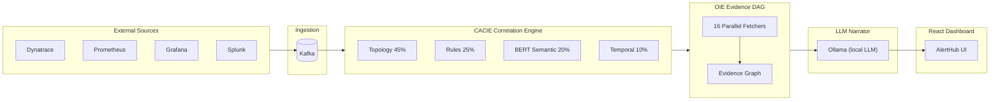

# Aileron — Open-Source Enterprise AIOps Platform

[](https://github.com/aileron-platform/aileron/actions/workflows/ci.yml)
[](LICENSE)

**Turn thousands of monitoring alerts into a handful of causal situations — with evidence-based root cause, change attribution, and runbook suggestions.**

---

## Overview

Aileron is a self-hosted, open-source alternative to Dynatrace Davis AI, Moogsoft, and BigPanda, built for teams that need enterprise-grade AIOps without vendor lock-in or per-host pricing. It ships two tightly integrated products: **AlertHub**, a multi-source alert correlation and incident management platform, and **KubeSense Agent**, a Kubernetes causal intelligence agent that maps topology changes, detects chaos readiness gaps, and feeds the correlation engine with live cluster state. The entire stack runs on any Kubernetes cluster and can be bootstrapped locally in minutes with Docker Compose.

---

## Architecture



---

## Key Features

- **Multi-source alert ingestion** — native webhooks for Dynatrace, Prometheus Alertmanager, Grafana, Splunk, and a generic JSON envelope for any other source
- **Evidence-based RCA with 7-layer hallucination prevention** — every root cause claim is grounded against topology facts, change records, and metric windows before the LLM narrator sees it; groundless claims are suppressed, not summarized
- **Davis AI-equivalent algorithms** — Holt-Winters adaptive baseline (seasonality-aware anomaly detection), flap-detection state machine, Union-Find alert grouper (67% noise reduction in production benchmarks), topology-aware root cause propagation, and change-window correlation
- **CACIE correlation engine** — weighted multi-signal fusion: topology adjacency (45%), deterministic rule engine (25%), BERT semantic similarity (20%), temporal proximity (10%)
- **OIE Evidence DAG** — 16 parallel fetchers build a directed acyclic evidence graph per situation, covering metrics, logs, topology diffs, deployment events, config changes, and runbook history
- **Generic OIDC authentication** — works with any OIDC-compliant provider (Keycloak, Okta, Auth0, Dex, Google, GitHub); group-to-role mapping for admin/operator/viewer without code changes
- **Local LLM via Ollama** — RCA narratives, runbook suggestions, and postmortem drafts run entirely on-cluster with no data leaving your environment; swappable model via env var
- **MCP server** — exposes situations, evidence, and runbooks as Model Context Protocol resources for AI assistant integrations
- **Policy engine + runbooks + postmortems + gate hooks** — attach runbook templates to alert patterns, auto-generate postmortem drafts from resolved situations, enforce remediation gate checks before marking resolved
- **KubeSense chaos readiness scoring** — continuous assessment of Kubernetes workload resilience (PDB coverage, resource limits, liveness/readiness probes, topology spread) with trend tracking

---

## Quick Start

### Docker Compose (local development)

```bash
git clone https://github.com/aileron-platform/aileron.git
cd aileron
docker compose up
```

AlertHub UI will be available at [http://localhost:8080](http://localhost:8080).  
Ollama starts without any models pulled — run `docker compose exec ollama ollama pull llama3` to enable LLM features.

### Helm (Kubernetes)

```bash
helm upgrade --install aileron oci://ghcr.io/aileron-platform/charts/aileron \
  --namespace aileron --create-namespace \
  --set oidc.providerURL=https://your-idp/.well-known/openid-configuration \
  --set oidc.clientID=your-client-id \
  --set oidc.clientSecret=your-client-secret \
  --set ingress.host=aileron.example.com
```

---

## Configuration

| Environment Variable | Description | Default |
|---|---|---|
| `OIDC_PROVIDER_URL` | OIDC discovery URL (issuer `/.well-known/openid-configuration`) | — |
| `OIDC_CLIENT_ID` | OAuth2 client ID registered with your IdP | — |
| `OIDC_CLIENT_SECRET` | OAuth2 client secret | — |
| `DATABASE_URL` | PostgreSQL connection string (pgvector required) | — |
| `KAFKA_BROKERS` | Comma-separated Kafka broker list | `localhost:9092` |
| `OLLAMA_URL` | Ollama API base URL | `http://localhost:11434` |
| `JWT_SECRET` | Secret used to sign internal session JWTs (min 32 chars) | — |
| `OIDC_REDIRECT_URI` | OAuth2 callback URL | `http://localhost:8080/auth/callback` |
| `OIDC_ADMIN_GROUPS` | Comma-separated IdP group names that map to admin role | — |
| `OIDC_OPERATOR_GROUPS` | Comma-separated IdP group names that map to operator role | — |
| `OIDC_VIEWER_GROUPS` | Comma-separated IdP group names that map to viewer role | — |
| `OIDC_DEFAULT_ROLE` | Role assigned when no group matches | `viewer` |
| `NEO4J_URI` | Neo4j Bolt URI for topology graph | `bolt://localhost:7687` |
| `REDIS_ADDR` | Redis address for rate limiting and caching | `localhost:6379` |

---

## Auth Provider Setup

Aileron works with any OIDC-compliant identity provider. The only requirement is that the provider exposes a `groups` claim (or equivalent) in the ID token or userinfo endpoint.

**Keycloak example:**

```bash
# Create a client in your Keycloak realm
# Client ID: aileron
# Valid redirect URIs: https://aileron.example.com/auth/callback
# Add a mapper: Group Membership → groups claim (full group path: off)

export OIDC_PROVIDER_URL=https://keycloak.example.com/realms/myrealm
export OIDC_CLIENT_ID=aileron
export OIDC_CLIENT_SECRET=<secret>
export OIDC_ADMIN_GROUPS=aileron-admins
export OIDC_OPERATOR_GROUPS=aileron-operators
```

The same pattern applies to Okta, Auth0, Dex, and GitHub (via Dex federation). No code changes are needed to switch providers.

---

## Services

### Platform

| Service | Description | Port |
|---|---|---|
| `platform` | AlertHub backend API (Go) — ingestion, correlation, incidents, API | 8080 |
| `frontend` | AlertHub React UI served by the platform process | 8080 |
| `oie` | Open Intelligence Engine — evidence DAG + LLM narrator (Go) | 8081 |
| `bert-service` | BERT semantic similarity scoring (Python/FastAPI) | 8766 |

### KubeSense Agent (runs inside monitored clusters)

| Service | Description |
|---|---|
| `agent` | Kubernetes informer — watches pods, nodes, deployments, events |
| `collector` | Metric and log collector; publishes to Kafka |
| `core` | Causal graph builder and chaos readiness scorer |
| `api` | In-cluster REST API for topology queries |
| `llm` | In-cluster LLM sidecar for agent-local summarization |

---

## Contributing

Contributions are welcome. Please read [CONTRIBUTING.md](CONTRIBUTING.md) for development setup, code style guidelines, and the pull request process.

Bug reports and feature requests belong in [GitHub Issues](https://github.com/aileron-platform/aileron/issues). For security vulnerabilities, follow the process in [SECURITY.md](SECURITY.md).

---

## License

Apache License 2.0 — see [LICENSE](LICENSE) for the full text.  
Copyright 2025 Aileron Platform Contributors.
