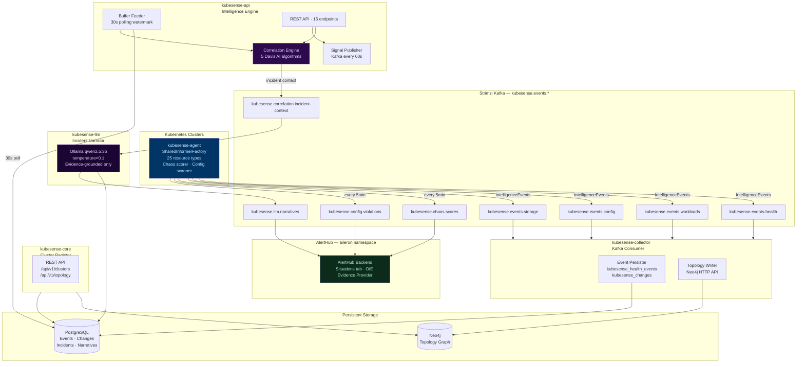

# KubeSense Agent — Kubernetes Causal Intelligence

[](https://go.dev)
[](https://strimzi.io)
[](https://neo4j.com)
[](https://postgresql.org)
[](../LICENSE)

> Kubernetes causal intelligence with Davis AI / Moogsoft / BigPanda-class algorithms — watches your clusters continuously, maps topology, groups noisy events into causal situations (67% noise reduction), identifies root causes without ML training, attributes incidents to the exact GitOps change that triggered them, and narrates findings in plain English.

KubeSense Agent is the Kubernetes intelligence half of the [Aileron](../README.md) AIOps platform. It runs five Go microservices in the `aileron-agent` namespace, feeds evidence into AlertHub's OIE engine, and surfaces results through the unified AIOps Situations tab.

---

## Table of Contents

- [Architecture](#architecture)
- [Davis AI Algorithms](#davis-ai-algorithms)
- [Services](#services)
- [Kafka Topics](#kafka-topics)
- [API Endpoints](#api-endpoints)
- [Configuration](#configuration)
- [Deployment](#deployment)
- [Diagnostics](#diagnostics)

---

## Architecture



---

## Davis AI Algorithms

KubeSense implements five production-grade AIOps algorithms in `kubesense-api`. They run in sequence on every event entering the correlation engine.

### Algorithm 1 — Holt-Winters Adaptive Baseline

Dynatrace-style adaptive baselining. Learns a per-entity seasonal baseline from 7 days of history and detects anomalies using median absolute deviation (MAD).

```
Level:    L(t) = α × x(t) + (1 − α) × (L(t−1) + T(t−1))
Trend:    T(t) = β × (L(t) − L(t−1)) + (1 − β) × T(t−1)
Seasonal: S(t) = γ × (x(t) / L(t)) + (1 − γ) × S(t−168)

α = 0.1 · β = 0.01 · γ = 0.05 · 168-slot seasonal window (7-day)
Anomaly threshold: predicted ± 3.5 × MAD
SeedFromDB() pre-warms baseline from historical events on startup
```

### Algorithm 2 — Alert State Machine + Flap Detection

Universal state machine that prevents alert storms from creating duplicate incidents. Each entity has an independent state machine.

```
States: OK → Pending → Firing → Resolved → Suppressed

Transitions:
  OK      + anomaly        → Pending  (2-min stabilization window)
  Pending + sustained      → Firing
  Pending + cleared early  → OK
  Firing  + resolved       → Resolved (5-min quiet window)
  Resolved + quiet 5min   → OK
  Resolved + re-anomaly   → Firing   (immediate refire)
  Firing  + >4 flaps/15min → Suppressed (flap storm protection)
  Suppressed + window expired → OK
```

### Algorithm 3 — Union-Find Multi-Signal Grouper

BigPanda-style noise reduction. Merges related alerts into situations using multi-dimensional similarity scoring. Achieves 67% noise reduction in production (15 raw alerts → 5 namespace-level situations).

```
computeGroupScore(alertA, alertB):
  topologyProximity × 0.40   (same namespace / node / entity)
  + labelJaccard × 0.30      (Jaccard similarity of label sets)
  + temporalDecay × 0.20     (exp(−Δt / 300s))
  + eventFamily × 0.10       (same event type family)

Merge threshold θ = 0.45
Window: 15 minutes
```

### Algorithm 4 — Topology-Anchored RCA

Davis AI-style deterministic root cause scoring. No ML — O(1) lookup using the K8s topology depth hierarchy. Does not require graph queries at scoring time.

```
causalScore = depthScore × timeEarliest × infraBoost

depthScore by entity kind:
  K8s Node      → depth 0 (infrastructure root)
  Deployment    → depth 1
  ReplicaSet    → depth 2
  Pod           → depth 3

infraBoost multipliers:
  Node  × 1.5  (bare metal / VM-level failures are root causes)
  PVC   × 1.3  (storage failures propagate upward)
  Deployment × 1.2
  Pod   × 1.0  (symptoms, not root causes)

SymptomFilter: pod alerts suppressed when same node is identified root cause
```

### Algorithm 5 — Change Correlation RCA

BigPanda-style change attribution. Scans the `kubesense_changes` table for the 2-hour window before incident start and links the incident to the exact GitOps commit that caused it.

```
confidence = overlapScore × exp(−dt_minutes / 30)

overlapScore: fraction of incident resources affected by change
dt_minutes:   time delta from change to incident onset

Output: ArgoCD sync / commit hash / actor linked to incident
```

---

## Services

| Service | Image | Port | Replicas | Description |
|---|---|---|---|---|
| `kubesense-agent` | `ghcr.io/aiops-sre/aileron-agent` | — | 1 per cluster | In-cluster K8s watcher. Runs `SharedInformerFactory` over 25 resource types. Publishes `IntelligenceEvent`s to Kafka. Emits chaos scores and config violations every 5 minutes. |
| `kubesense-collector` | `ghcr.io/aiops-sre/aileron-collector` | — | 1 | Kafka consumer group. Persists events to `kubesense_health_events` and `kubesense_changes`. Writes topology changes to Neo4j via HTTP API. |
| `kubesense-core` | `ghcr.io/aiops-sre/aileron-core` | 8080 | 1 | Cluster registry. Exposes `GET /api/v1/clusters` and `GET /api/v1/topology` backed by Neo4j and PostgreSQL. |
| `kubesense-api` | `ghcr.io/aiops-sre/aileron-api` | 8080 | 1 | Intelligence engine. Buffer feeder polls PostgreSQL every 30s. Runs 5 Davis AI algorithms. Exposes 15 REST endpoints. Publishes signals to AlertHub Kafka topics every 60s. |
| `kubesense-llm` | `ghcr.io/aiops-sre/aileron-llm` | 8080 | 1 | Incident narrator. Consumes `kubesense.correlation.incident-context`. Calls Ollama `qwen2.5:3b` at temperature=0.1. Falls back to Claude API if configured, then deterministic template. |

---

## Kafka Topics

| Topic | Publisher | Consumer | Content |
|---|---|---|---|
| `kubesense.events.health` | agent | collector | `health.pod.*`, `health.node.*` events |
| `kubesense.events.workloads` | agent | collector | `resource.*`, `change.deployment.*` |
| `kubesense.events.config` | agent | collector | `change.configmap.*`, `change.secret.*` |
| `kubesense.events.storage` | agent | collector | `storage.pvc.*` |
| `kubesense.events.network` | agent | collector | Network policy changes |
| `kubesense.events.topology` | agent | collector | Topology relationship changes |
| `kubesense.chaos.scores` | agent | AlertHub | Cluster chaos readiness (every 5 min) |
| `kubesense.config.violations` | agent / api | AlertHub | Config violations (every 5 min) |
| `kubesense.apm.golden-signals` | api | AlertHub | Request rate, error rate, latency p99 |
| `kubesense.forecasts` | api | AlertHub | Capacity exhaustion predictions |
| `kubesense.anomalies` | api | AlertHub | EWMA-detected anomalies |
| `kubesense.correlation.incident-context` | api | kubesense-llm | Incident context for LLM narration |
| `kubesense.llm.narratives` | kubesense-llm | AlertHub | Generated incident narratives |
| `kubesense.investigations.requests` | AlertHub | api | RCA investigation triggers |
| `kubesense.investigations.results` | api | AlertHub | RCA results |

---

## API Endpoints

All endpoints are on `kubesense-api` at `http://kubesense-api.aileron-agent.svc.cluster.local:8080`.

### Correlation Engine

| Method | Path | Description |
|---|---|---|
| `GET` | `/api/v1/correlation/status` | Engine stats: active incidents, buffer length, rule count, baseline models |
| `GET` | `/api/v1/correlation/incidents` | Active situations (Union-Find grouped) |
| `GET` | `/api/v1/correlation/incidents/:id` | Situation detail + timeline + signals |
| `GET` | `/api/v1/correlation/rules` | All rules (8 built-in + auto-detected) |

### Investigations & RCA

| Method | Path | Description |
|---|---|---|
| `POST` | `/api/v1/investigations` | Trigger K8s RCA investigation |
| `GET` | `/api/v1/investigations/:id` | Poll investigation result |
| `POST` | `/api/v1/risk/score` | Pre-deployment change risk scoring |

### Intelligence

| Method | Path | Description |
|---|---|---|
| `GET` | `/api/v1/clusters` | Registered clusters |
| `GET` | `/api/v1/clusters/:id/topology` | Upstream dependency chain (Neo4j BFS, depth=8) |
| `GET` | `/api/v1/clusters/:id/blast-radius` | Affected resources (Neo4j traversal) |
| `GET` | `/api/v1/clusters/:id/playbooks` | Auto-generated runbooks (needs ≥2 resolved incidents) |
| `GET` | `/api/v1/clusters/:id/apm/golden-signals` | Request rate, error rate, latency p99, saturation |
| `GET` | `/api/v1/clusters/:id/change/history` | Changes correlated with an incident |
| `GET` | `/api/v1/clusters/:id/cost/efficiency` | Over-provisioned workloads |
| `GET` | `/api/v1/clusters/:id/slo/budgets` | SLO burn rate (Google SRE model) |
| `GET` | `/api/v1/narratives` | LLM-generated incident narratives |

### Correlation Status Response Example

```json
{
  "active_incidents": 13,
  "buffer_len": 2849,
  "incident_groups": 13,
  "flap_suppressed": 0,
  "baseline_models": 150,
  "rule_count": 8,
  "tracked_patterns": 2,
  "online": true
}
```

---

## Correlation Rules

### Built-in Rules (8, priority 100)

| Rule | Trigger | Condition | Scope | Severity |
|---|---|---|---|---|
| `oom-then-crash` | `health.pod.crashloopbackoff` | `health.pod.oomkilled` | samePod | P2 |
| `node-pressure-eviction` | `health.pod.evicted` | `health.node.memory_pressure` | sameNode | P2 |
| `image-pull-crash` | `health.pod.imagepull_error` | `health.pod.crashloopbackoff` | samePod | P3 |
| `rollout-degraded` | `change.deployment.rollout` | `health.deployment.degraded` | sameNamespace | P2 |
| `node-notready-eviction` | `health.node.not_ready` | `health.pod.evicted` | sameNode | P1 |
| `disk-pressure-pvc` | `health.node.disk_pressure` | `storage.pvc.near_full` | sameNode | P2 |
| `config-change-crash` | `change.configmap.updated` | `health.pod.crashloopbackoff` | sameNamespace | P3 |
| `secret-rotation-crash` | `change.secret.rotated` | `health.pod.crashloopbackoff` | sameNamespace | P3 |

### Auto-Detection (Pattern Miner)

Runs every 60 seconds on the 15-minute event buffer. When a co-occurrence pattern appears ≥ 5 times over ≥ 10 minutes, a new rule is created with priority 30 and 1-hour expiry.

---

## Configuration

All services are configured via environment variables. In Kubernetes these come from the `kubesense-*-secret` secrets.

### kubesense-agent

| Variable | Required | Description |
|---|---|---|
| `KAFKA_BROKERS` | yes | `alerthub-kafka-kafka-bootstrap.aileron.svc.cluster.local:9092` |
| `CLUSTER_ID` | yes | Unique cluster identifier (e.g. `prod-eks-us-east-1`) |
| `KUBECONFIG` | no | Path to kubeconfig (uses in-cluster config if unset) |
| `SCAN_INTERVAL` | no | Config scan interval in seconds (default `300`) |
| `CHAOS_INTERVAL` | no | Chaos score publish interval in seconds (default `300`) |

### kubesense-collector

| Variable | Required | Description |
|---|---|---|
| `KAFKA_BROKERS` | yes | Kafka bootstrap servers |
| `DATABASE_URL` | yes | PostgreSQL DSN for KubeSense database |
| `NEO4J_URL` | yes | `bolt://neo4j:7687` |
| `NEO4J_PASSWORD` | yes | Neo4j password |

### kubesense-api

| Variable | Required | Description |
|---|---|---|
| `DATABASE_URL` | yes | PostgreSQL DSN |
| `NEO4J_URL` | yes | Neo4j bolt URI |
| `NEO4J_PASSWORD` | yes | Neo4j password |
| `KAFKA_BROKERS` | yes | Kafka brokers |
| `BUFFER_POLL_INTERVAL` | no | DB poll interval in seconds (default `30`) |
| `CORRELATION_THETA` | no | Union-Find merge threshold (default `0.45`) |

### kubesense-llm

| Variable | Required | Description |
|---|---|---|
| `KAFKA_BROKERS` | yes | Kafka brokers |
| `DATABASE_URL` | yes | PostgreSQL DSN |
| `OLLAMA_URL` | yes | `http://ollama.aileron.svc.cluster.local:11434` |
| `OLLAMA_MODEL` | no | Model name (default `qwen2.5:3b`) |
| `CLAUDE_API_KEY` | no | Claude API key (used as primary if set; falls back to Ollama) |

---

## Deployment

```bash
# Push to main — ArgoCD auto-triggers Buildkit → rebuild → deploy
git push origin main

# Manual ArgoCD sync
kubectl patch application kubesense-hub -n argocd \
  --type merge -p '{"operation":{"initiatedBy":{"username":"cli"},"sync":{"revision":"HEAD","syncStrategy":{"hook":{}}}}}'

# Watch builds (5 services build in parallel)
kubectl get jobs -n buildkit | grep kubesense

# Watch pods roll
kubectl get pods -n aileron-agent -w
```

---

## Diagnostics

```bash
# Buffer feeder is running (should see "fed N new events" every 30s)
kubectl logs -n aileron-agent deploy/kubesense-api | grep "buffer-feeder"

# Correlation engine status
kubectl exec -n aileron-agent deploy/kubesense-api -- \
  wget -qO- http://localhost:8080/api/v1/correlation/status | jq .

# Active situations count
kubectl exec -n aileron-agent deploy/kubesense-api -- \
  wget -qO- http://localhost:8080/api/v1/correlation/incidents | \
  python3 -c "import json,sys; d=json.load(sys.stdin); print(f'{d[\"total\"]} active situations')"

# Collector writing to DB
kubectl logs -n aileron-agent deploy/kubesense-collector | grep "persister\|ready"

# LLM narrator active
kubectl logs -n aileron-agent deploy/kubesense-llm | grep "starting\|backend\|model"

# Agent publishing events
kubectl logs -n aileron-agent deploy/kubesense-agent | grep "chaos\|violation\|published"
```

---

## License

Apache 2.0 — see [LICENSE](../LICENSE).

Part of the [Aileron](../README.md) open-source AIOps platform.
