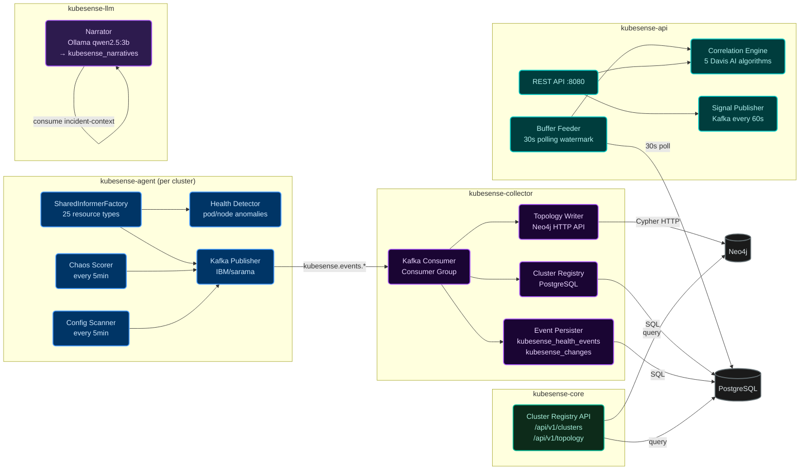
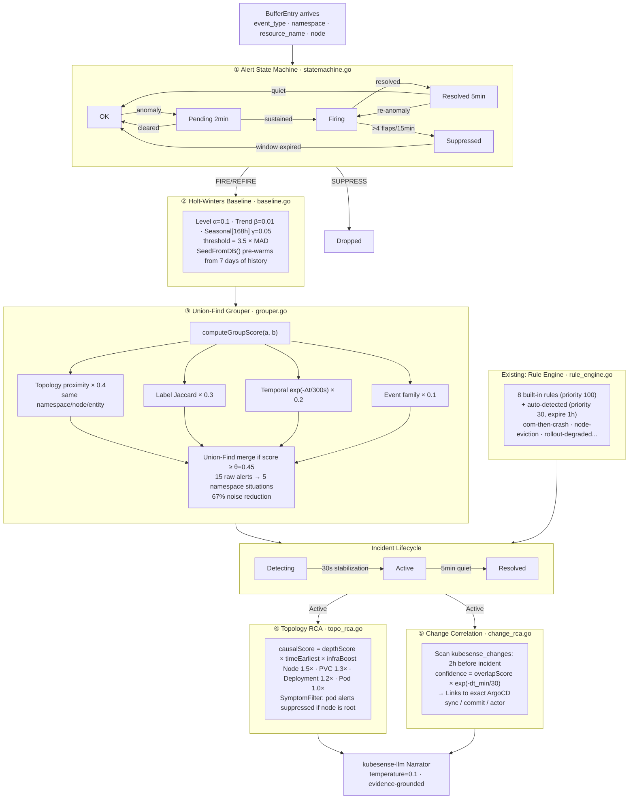
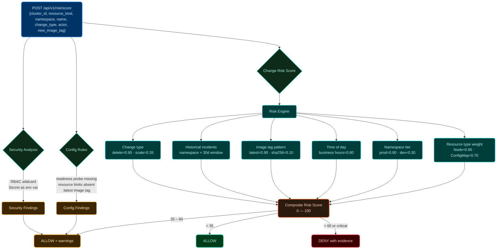
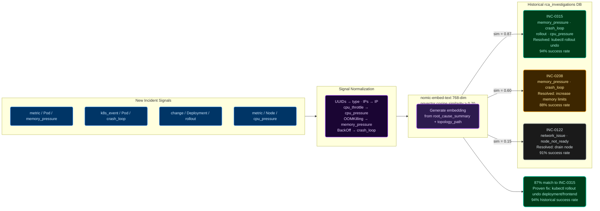
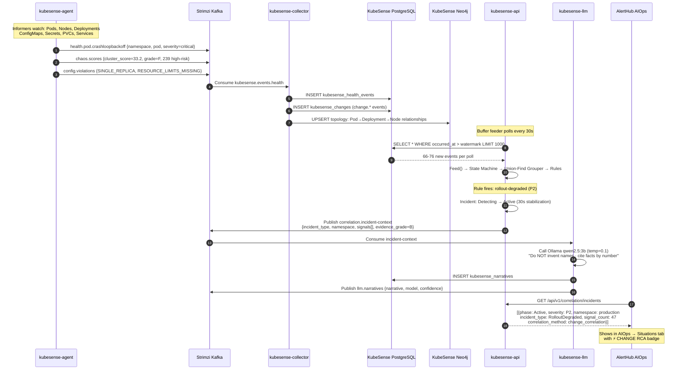

# KubeSense — Kubernetes Intelligence Platform

[](https://go.dev)
[](https://strimzi.io)
[](https://neo4j.com)
[](https://postgresql.org)

> **Kubernetes intelligence platform with Davis AI / Moogsoft / BigPanda-class algorithms.**
> Watches your clusters continuously, groups noisy events into causal situations, surfaces the root cause (pod → node → change → commit), and narrates what happened in plain English.

| | |
|---|---|
| **Namespace** | `aileron-agent` on `example-cluster` |
| **Repo** | `github.com/aileron-platform/aileron` |
| **Registry** | `ghcr.io/aileron-platform/aileron-admins` |
| **AlertHub Integration** | `github.com/aileron-platform/aileron` |

---

## What It Does

KubeSense is the **Kubernetes intelligence layer** of the SRE Command Center. It watches every K8s resource continuously, correlates events using 5 production-grade AIOps algorithms, identifies root causes via topology scoring, attributes incidents to the exact GitOps change that caused them, and narrates what happened in plain English — all surfaced through AlertHub's AIOps Situations tab as a unified view.

---

## Platform Architecture

```mermaid
graph TB
    classDef cluster  fill:#1a1a2e,stroke:#4a9eff,stroke-width:2px,color:#e0e8ff,rx:8
    classDef kafka    fill:#1a1a2e,stroke:#f39c12,stroke-width:2px,color:#ffeaa7,rx:4
    classDef engine   fill:#0d1b2a,stroke:#6c63ff,stroke-width:2px,color:#d4c9ff,rx:6
    classDef storage  fill:#0d1b2a,stroke:#00cec9,stroke-width:2px,color:#b2f0ee,rx:6
    classDef service  fill:#0d1b2a,stroke:#00b894,stroke-width:2px,color:#a8f0e3,rx:6
    classDef llmnode  fill:#2d1b4e,stroke:#a855f7,stroke-width:2px,color:#e9d5ff,rx:6
    classDef alert    fill:#2d1a0e,stroke:#ff6b35,stroke-width:2px,color:#ffd4bc,rx:6

    subgraph Clusters["Kubernetes Clusters"]
        A1["kubesense-agent\nSharedInformerFactory × 25 types\nTopology · Health · Chaos · Config"]
    end

    subgraph Kafka["Strimzi Kafka — kubesense.events.*"]
        K1["kubesense.events.health"]
        K2["kubesense.events.workloads"]
        K3["kubesense.events.config"]
        K4["kubesense.events.storage"]
        K5["kubesense.chaos.scores"]
        K6["kubesense.config.violations"]
        K7["correlation.incident-context"]
        K8["llm.narratives"]
    end

    subgraph Core["kubesense-api — Intelligence Engines"]
        CORR["Correlation Engine\nDavis AI / Moogsoft / BigPanda algorithms"]
        RCA["RCA Engine\nTopology-anchored · Change correlation"]
        APM["APM Tracker\nGolden Signals"]
        ANA["Anomaly Detector\nEWMA self-learning"]
        COST["Cost Analyzer\nRightsizing"]
        SLO["SLO Tracker\nBurn Rate"]
        RISK["Risk Engine\nPre-deploy scoring"]
        FP["Fingerprint Engine\nJaccard similarity"]
        PB["Playbook Generator\nAuto runbooks"]
        CHG["Change Correlator\nGitOps attribution"]
        CHAOS["Chaos Scorer\nReadiness 0-100"]
    end

    subgraph Storage["Persistent Storage"]
        NEO[("Neo4j\nTopology Graph")]
        PG[("PostgreSQL\nEvents · Changes · Incidents")]
    end

    subgraph Services["Services"]
        API["kubesense-api\nREST API :8080"]
        LLM["kubesense-llm\nOllama Narrator"]
        COLL["kubesense-collector\nKafka → DB + Neo4j"]
        CORE["kubesense-core\nCluster registry"]
    end

    subgraph AlertHub["AlertHub — aileron"]
        AH["AlertHub Backend\nSituations tab · OIE evidence"]
    end

    A1 -->|"IntelligenceEvents"| K1 & K2 & K3 & K4 & K5 & K6
    K1 & K2 & K3 & K4 -->|"consume"| COLL
    COLL --> NEO & PG
    CORR -->|"query"| PG
    CORR -->|"incident context"| K7
    K7 -->|"consume"| LLM
    LLM -->|"narrative"| K8
    K8 -->|"enrich"| AH
    API --> CORR & RCA & RISK & FP & PB & CHG & CHAOS
    K5 & K6 -->|"forward"| AH

    class A1 cluster
    class K1,K2,K3,K4,K5,K6,K7,K8 kafka
    class CORR,RCA,APM,ANA,COST,SLO,RISK,FP,PB,CHG,CHAOS engine
    class NEO,PG storage
    class API,COLL,CORE service
    class LLM llmnode
    class AH alert
```



---

## Intelligence Stack

```mermaid
flowchart LR
    classDef oItem fill:#004a8a,stroke:#4a9eff,stroke-width:1.5px,color:#ddeeff,rx:5
    classDef uItem fill:#2d0a4e,stroke:#a855f7,stroke-width:1.5px,color:#ead6ff,rx:5
    classDef aItem fill:#005c28,stroke:#00b894,stroke-width:1.5px,color:#c3f5da,rx:5
    classDef pItem fill:#5c1e00,stroke:#ff6b35,stroke-width:1.5px,color:#ffd9c0,rx:5
    classDef sItem fill:#003d3d,stroke:#00cec9,stroke-width:1.5px,color:#b2f0ee,rx:5

    subgraph OBSERVE["① OBSERVE"]
        O1["K8s Events\n25 resource types"]
        O2["Topology Graph\nNeo4j all edge types"]
        O3["Health Checks\nPod + Node"]
        O4["Changes\nGitOps correlation"]
        O5["Violations\nConfig scanner"]
        O6["Chaos Scores\nEvery 5 minutes"]
    end

    subgraph UNDERSTAND["② UNDERSTAND"]
        U1["Holt-Winters Baseline\nPer entity · 168h seasonal"]
        U2["Flap Detection\nState machine hysteresis"]
        U3["Union-Find Grouper\n15 alerts → 5 situations"]
        U4["Topology RCA\nNode > PVC > Deployment > Pod"]
        U5["Change Correlation\nArgoCD commit attribution"]
        U6["Semantic Similarity\nnomic-embed-text 768-dim"]
    end

    subgraph ACT["③ ACT"]
        A1["LLM Narrative\nEvidence-grounded only"]
        A2["Change Attribution\nExact commit + actor"]
        A3["Blast Radius\nNeo4j traversal"]
        A4["Playbooks\nFrom resolved incidents"]
        A5["AlertHub Situations\nUnified AIOps view"]
    end

    subgraph PREVENT["④ PREVENT"]
        P1["Pre-deploy Risk\nComposite score 0-100"]
        P2["Config Violations\nMissing probes · :latest"]
        P3["Chaos Readiness\nGrade A-F"]
        P4["SLO Burn Rate\nGoogle SRE model"]
    end

    OBSERVE -->|"stream"| UNDERSTAND
    UNDERSTAND -->|"intelligence"| ACT
    ACT -->|"prevents future"| PREVENT
    PREVENT -.->|"feedback"| OBSERVE

    class O1,O2,O3,O4,O5,O6 oItem
    class U1,U2,U3,U4,U5,U6 uItem
    class A1,A2,A3,A4,A5 aItem
    class P1,P2,P3,P4 pItem
```



---

## Service Map



---

## Correlation Engine — 5 Davis AI Algorithms



---

## Incident Investigation Flow

```mermaid
sequenceDiagram
    autonumber
    participant AH  as AlertHub
    participant API as kubesense-api
    participant RCA as RCA Engine
    participant NEO as Neo4j
    participant PG  as PostgreSQL
    participant COR as Correlation Engine
    participant LLM as kubesense-llm<br/>Ollama qwen2.5:3b
    participant OPS as Operator

    AH->>+API: POST /api/v1/investigations
    Note over AH,API: {incident_id, cluster_id, affected_resources, incident_time}
    API->>+RCA: Investigate(request)

    rect rgb(0, 40, 100)
        Note over RCA,NEO: Step 1 — Build dependency chain
        RCA->>+NEO: GetUpstreamChain(Pod/frontend, depth=8)
        NEO-->>-RCA: Node/worker-3 · Deployment/frontend · ConfigMap/app-config
    end

    rect rgb(60, 20, 80)
        Note over RCA,PG: Step 2 — Gather evidence + change attribution
        RCA->>NEO: GetK8sEventsFor(each node in chain)
        NEO-->>RCA: OOMKilling · BackOff · Failed x3
        RCA->>+PG: GetRecentChanges(kubesense_changes, 6h lookback)
        PG-->>-RCA: change.deployment.rollout 8m ago — strong causal signal
    end

    rect rgb(0, 60, 30)
        Note over RCA: Step 3 — Score hypotheses (Algorithm 4: Topology RCA)
        RCA->>RCA: depthScore × timeEarliest × infraBoost
        RCA->>RCA: Node (1.5×) beats Pod (1.0×) — infra root cause prioritized
        RCA->>RCA: change within 1h → recency confidence boost
    end

    RCA-->>-API: RootCause: Deployment/frontend · confidence=0.87 · evidence_grade=A
    API->>COR: Feed incident signals → Correlation Engine

    API-)LLM: Publish to kubesense.correlation.incident-context
    Note over LLM: Evidence-grounded prompt · temperature=0.1<br/>facts numbered · "Do NOT invent names"
    LLM--)PG: INSERT kubesense_narratives
    LLM--)AH: kubesense.llm.narratives → Situations tab

    API-->>-OPS: root_cause · confidence 87% · evidence_grade A
    Note over OPS: Change identified: git commit abc123 by user@apple.com<br/>kubectl rollout undo deployment/frontend -n payments
```



---

## Pre-Deploy Risk Scoring Flow



---

## Incident Fingerprinting (Historical Similarity)



---

## Event Flow (End-to-End)



---

## Correlation Rules

### Built-in Rules (8, priority=100)

| Rule Name | Trigger Event | Condition Event | Scope | Severity |
|---|---|---|---|---|
| `oom-then-crash` | `health.pod.crashloopbackoff` | `health.pod.oomkilled` | samePod | P2 |
| `node-pressure-eviction` | `health.pod.evicted` | `health.node.memory_pressure` | sameNode | P2 |
| `image-pull-crash` | `health.pod.imagepull_error` | `health.pod.crashloopbackoff` | samePod | P3 |
| `rollout-degraded` | `change.deployment.rollout` | `health.deployment.degraded` | sameNamespace | P2 |
| `node-notready-eviction` | `health.node.not_ready` | `health.pod.evicted` | sameNode | P1 |
| `disk-pressure-pvc` | `health.node.disk_pressure` | `storage.pvc.near_full` | sameNode | P2 |
| `config-change-crash` | `change.configmap.updated` | `health.pod.crashloopbackoff` | sameNamespace | P3 |
| `secret-rotation-crash` | `change.secret.rotated` | `health.pod.crashloopbackoff` | sameNamespace | P3 |

### Auto-Detection (Pattern Miner, every 60s)

Pattern miner runs every 60s on the 15-minute buffer. When a co-occurrence pattern appears ≥5 times over ≥10 minutes, it creates a rule:

```sql
-- Example auto-detected rule (priority=30, expires 1h after last observation):
INSERT INTO kubesense_correlation_rules
  (name, priority, trigger_event_type, conditions, fires_severity,
   scope, auto_generated, data_points, expires_at)
VALUES
  ('auto.health-pod-imagepull-error.health-pod-pending.samePod',
   30, 'health.pod.imagepull_error',
   '[{"event_type":"health.pod.pending","scope":"samePod"}]',
   'P2', 'samePod', TRUE, 847, now() + interval '1 hour')
```

---

## REST API

### kubesense-api (`http://kubesense-api.aileron-agent.svc.cluster.local:8080`)

| Method | Path | Description |
|---|---|---|
| `GET` | `/healthz` | Health check |
| `GET` | `/api/v1/clusters` | List registered clusters |
| `GET` | `/api/v1/clusters/:id/topology` | Upstream dependency chain (Neo4j BFS, depth=8) |
| `GET` | `/api/v1/clusters/:id/blast-radius?kind=X&name=Y` | Affected resources (Neo4j traversal) |
| `GET` | `/api/v1/clusters/:id/playbooks` | Auto-generated runbooks (need ≥2 resolved incidents) |
| `GET` | `/api/v1/clusters/:id/security/posture` | RBAC/network policy gaps |
| `GET` | `/api/v1/clusters/:id/cost/efficiency` | Over-provisioned workloads |
| `GET` | `/api/v1/clusters/:id/anomalies` | EWMA-detected anomalies |
| `GET` | `/api/v1/clusters/:id/slo/budgets` | SLO burn rate |
| `GET` | `/api/v1/clusters/:id/apm/golden-signals` | Request rate, error rate, latency p99, saturation |
| `GET` | `/api/v1/clusters/:id/change/history?incident_id=X` | Changes correlated with an incident |
| `POST` | `/api/v1/investigations` | Trigger K8s RCA investigation (sync or async) |
| `GET` | `/api/v1/investigations/:id` | Poll investigation result |
| `POST` | `/api/v1/risk/score` | Pre-deployment change risk scoring |
| `GET` | `/api/v1/correlation/status` | Correlation engine stats |
| `GET` | `/api/v1/correlation/incidents` | Active situations |
| `GET` | `/api/v1/correlation/incidents/:id` | Situation detail + timeline |
| `GET` | `/api/v1/correlation/rules` | All correlation rules (built-in + auto-detected) |
| `GET` | `/api/v1/narratives` | LLM-generated incident narratives |
| `GET` | `/api/v1/narratives/:incident_id` | Single narrative with token counts |

### Correlation Status Response

```json
{
  "active_incidents": 13,
  "buffer_len": 2849,
  "incident_groups": 13,
  "flap_suppressed": 0,
  "baseline_models": 150,
  "rule_count": 8,
  "tracked_patterns": 2,
  "online": true
}
```

---

## Kafka Topics

| Topic | Publisher | Consumer | Content |
|---|---|---|---|
| `kubesense.events.health` | agent | collector | `health.pod.*`, `health.node.*` |
| `kubesense.events.workloads` | agent | collector | `resource.*`, `change.*` |
| `kubesense.events.config` | agent | collector | `change.configmap.*`, `change.secret.*` |
| `kubesense.events.storage` | agent | collector | `storage.pvc.*` |
| `kubesense.events.network` | agent | collector | Network policy changes |
| `kubesense.events.topology` | agent | collector | Topology changes |
| `kubesense.chaos.scores` | agent | AlertHub | Cluster chaos readiness (every 5min) |
| `kubesense.config.violations` | agent/api | AlertHub | Config violations (every 5min) |
| `kubesense.apm.golden-signals` | api | AlertHub | Request rate, error rate, latency |
| `kubesense.forecasts` | api | AlertHub | Capacity predictions |
| `kubesense.anomalies` | api | AlertHub | EWMA anomalies |
| `kubesense.correlation.incident-context` | api | kubesense-llm | Incident context for LLM narration |
| `kubesense.llm.narratives` | kubesense-llm | AlertHub | Generated narratives |
| `kubesense.investigations.requests` | AlertHub | api | RCA investigation requests |
| `kubesense.investigations.results` | api | AlertHub | RCA results |

---

## Database Schema

### kubesense_health_events
```sql
CREATE TABLE kubesense_health_events (
    id            VARCHAR(64)  PRIMARY KEY,
    cluster_id    VARCHAR(128) NOT NULL,
    event_type    VARCHAR(100) NOT NULL,
    severity      VARCHAR(20)  NOT NULL,
    resource_kind VARCHAR(64),
    namespace     VARCHAR(255),
    resource_name VARCHAR(255),
    resource_uid  VARCHAR(64),
    occurred_at   TIMESTAMP NOT NULL,
    received_at   TIMESTAMP DEFAULT NOW()
);
-- Critical indexes for 17M+ row table:
CREATE INDEX idx_ks_he_cluster_occurred ON kubesense_health_events(cluster_id, occurred_at DESC);
CREATE INDEX idx_ks_he_cluster_type     ON kubesense_health_events(cluster_id, event_type);
CREATE INDEX idx_ks_he_ns_name          ON kubesense_health_events(namespace, resource_name) WHERE namespace IS NOT NULL;
```

### kubesense_changes
```sql
CREATE TABLE kubesense_changes (
    id            VARCHAR(64)  PRIMARY KEY,
    cluster_id    VARCHAR(128) NOT NULL,
    change_type   VARCHAR(100) NOT NULL,
    resource_kind VARCHAR(64),
    namespace     VARCHAR(255),
    resource_name VARCHAR(255),
    actor         VARCHAR(255),  -- who made the change (ArgoCD, kubectl, etc.)
    occurred_at   TIMESTAMP NOT NULL
);
-- Used by change_rca.go: scans 2h before incident start
```

### kubesense_correlation_rules
```sql
CREATE TABLE kubesense_correlation_rules (
    id                  VARCHAR(64)  PRIMARY KEY,
    name                VARCHAR(255) NOT NULL UNIQUE,
    priority            INTEGER      NOT NULL DEFAULT 100,
    trigger_event_type  VARCHAR(100) NOT NULL,
    conditions          JSONB        NOT NULL DEFAULT '[]',
    fires_incident_type VARCHAR(100) NOT NULL,
    fires_severity      VARCHAR(10)  NOT NULL,  -- P1, P2, P3, P4
    fires_summary       TEXT         NOT NULL,  -- Go text/template: {{.Namespace}}, {{.PodName}}
    scope               VARCHAR(20)  NOT NULL DEFAULT 'samePod',
    auto_generated      BOOLEAN      NOT NULL DEFAULT FALSE,
    data_points         INTEGER      NOT NULL DEFAULT 0,
    expires_at          TIMESTAMPTZ  -- NULL for built-in rules, 1h for auto-generated
);
```

### kubesense_incidents
```sql
CREATE TABLE kubesense_incidents (
    id                 VARCHAR(64)   PRIMARY KEY,
    cluster_id         VARCHAR(128)  NOT NULL,
    fingerprint        VARCHAR(64)   NOT NULL,  -- SHA-1 of "Level|namespace|kind|name"
    incident_type      VARCHAR(100)  NOT NULL,  -- e.g. "OOMCrashLoop", "RolloutDegraded"
    severity           VARCHAR(10)   NOT NULL,  -- P1, P2, P3, P4
    phase              VARCHAR(20)   NOT NULL DEFAULT 'Detecting',  -- Detecting, Active, Resolved
    summary            TEXT,
    namespace          VARCHAR(255),
    resource_kind      VARCHAR(64),
    resource_name      VARCHAR(255),
    rule_name          VARCHAR(255),
    first_observed_at  TIMESTAMPTZ   NOT NULL DEFAULT NOW(),
    active_at          TIMESTAMPTZ,    -- set when Detecting→Active
    last_observed_at   TIMESTAMPTZ   NOT NULL DEFAULT NOW(),
    resolved_at        TIMESTAMPTZ,
    signal_count       INTEGER       NOT NULL DEFAULT 1,
    correlated_signals JSONB         NOT NULL DEFAULT '[]',
    timeline           JSONB         NOT NULL DEFAULT '[]'  -- [{time, event}]
);
```

### kubesense_narratives
```sql
CREATE TABLE kubesense_narratives (
    incident_id    VARCHAR(64)  PRIMARY KEY,
    cluster_id     VARCHAR(128),
    narrative      TEXT         NOT NULL,
    model          VARCHAR(100),  -- "ollama/qwen2.5:3b" or "fallback"
    evidence_grade VARCHAR(5),
    confidence     FLOAT,
    input_tokens   INTEGER DEFAULT 0,
    output_tokens  INTEGER DEFAULT 0,
    generated_at   TIMESTAMPTZ NOT NULL DEFAULT NOW()
);
```

---

## Deployment

### Helm Chart Structure

```
helm/kip-hub/
├── Chart.yaml
├── values.yaml                   # Defaults (all services)
├── values-example-cluster.yaml       # Environment overrides
└── templates/
    ├── build.yaml                # 5 Buildkit PreSync jobs
    └── deployments.yaml          # 5 service deployments + services + kubesense-llm
```

### Deploy

```bash
# Push to main → ArgoCD auto-triggers Buildkit → rebuilds → deploys
git push origin main

# Manual sync if needed
kubectl patch application kubesense-hub -n argocd \
  --type merge -p '{"operation":{"initiatedBy":{"username":"cli"},"sync":{"revision":"HEAD","syncStrategy":{"hook":{}}}}}'

# Watch builds (5 services build in parallel)
kubectl get jobs -n buildkit | grep kubesense

# Watch pods roll
kubectl get pods -n aileron-agent -w
```

### LLM Configuration

```yaml
# values-example-cluster.yaml
llm:
  ollamaURL: "http://ollama.aileron.svc.cluster.local:11434"
  ollamaModel: "qwen2.5:7b"    # kubesense-llm uses this
  # CLAUDE_API_KEY via kubesense-llm-secret (optional — falls back to Ollama)
```

Available on cluster Ollama:
- `qwen2.5:3b` — loaded, used by OIE (AlertHub)
- `nomic-embed-text:latest` — loaded, 768-dim semantic embeddings

---

## Diagnostics

```bash
# Buffer feeder is running (should see "fed N new events" every 30s)
kubectl logs -n aileron-agent kubesense-api-<pod> | grep "buffer-feeder"

# Correlation status
kubectl exec -n aileron-agent kubesense-api-<pod> -- \
  wget -qO- http://localhost:8080/api/v1/correlation/status

# Active situations
kubectl exec -n aileron-agent kubesense-api-<pod> -- \
  wget -qO- "http://localhost:8080/api/v1/correlation/incidents" | \
  python3 -c "import json,sys; d=json.load(sys.stdin); print(f'{d[\"total\"]} situations')"

# Collector writing to DB
kubectl logs -n aileron-agent kubesense-collector-<pod> | grep "persister\|ready"

# LLM narrator active
kubectl logs -n aileron-agent kubesense-llm-<pod> | grep "starting\|backend\|model"

# Agent sending events
kubectl logs -n aileron-agent kubesense-agent-<pod> | grep "chaos\|violation\|published"
```

---

## License

Apache 2.0 — Open Source. See LICENSE.
