# Alerthub Enterprise AIOps - Comprehensive Architecture Design

## Table of Contents
1. [Current State Analysis](#current-state-analysis)
2. [Microservices Architecture Overview](#microservices-architecture-overview)
3. [Component-Wise Detailed Architecture](#component-wise-detailed-architecture)
4. [Algorithm Specifications](#algorithm-specifications)
5. [Network Flow & Communication](#network-flow--communication)
6. [Data Architecture & Storage](#data-architecture--storage)
7. [Implementation Roadmap](#implementation-roadmap)

---

## Current State Analysis

### Existing Infrastructure & Services ✅

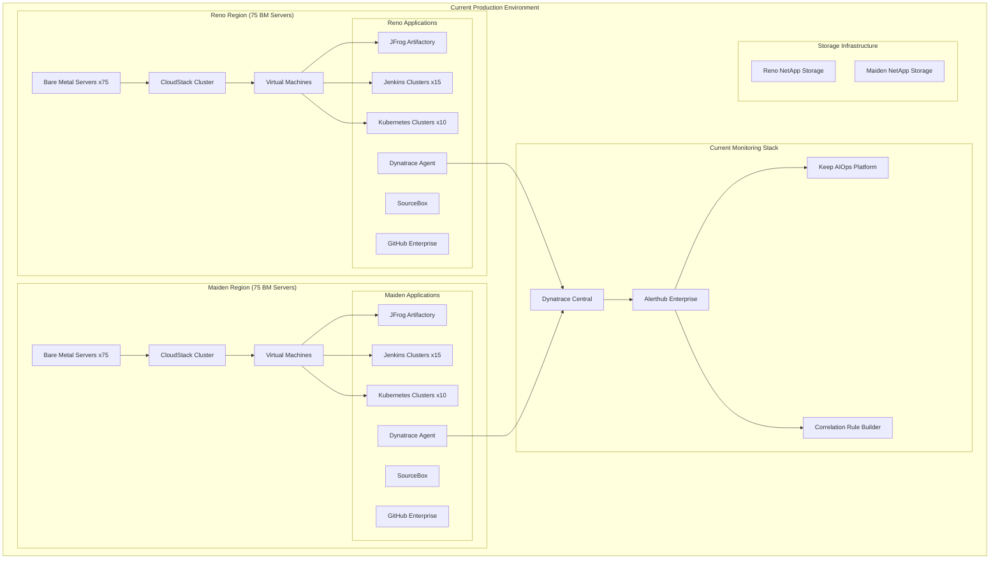

### Existing Services Assessment

| Service | Status | Technology | Capabilities |
|---------|--------|------------|-------------|
| **Alerthub Enterprise** | ✅ Production | Go Backend, React Frontend | Basic incident management, manual correlation |
| **Dynatrace Monitoring** | ✅ Production | APM Platform | Full-stack monitoring, metrics, traces |
| **Keep AIOps** | ✅ Production | Python, AI Engine | Basic AI correlation, alert enrichment |
| **CloudStack Management** | ✅ Production | Java Platform | VM lifecycle, resource management |
| **Kubernetes Clusters** | ✅ Production | Container Orchestration | 10+ clusters per region |
| **Jenkins CI/CD** | ✅ Production | Automation Platform | 15+ clusters per region |
| **NetApp Storage** | ✅ Production | Storage Arrays | Shared storage across regions |

### Current Limitations 🚫

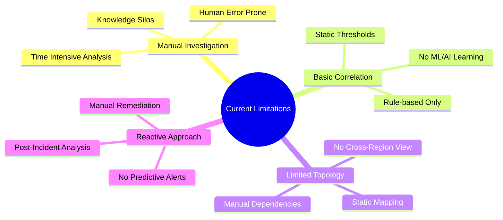

---

## Microservices Architecture Overview

### Target Architecture - Existing vs New Services

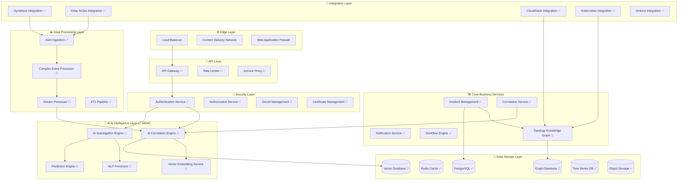

**Legend:**
- ✅ **Existing Services** (Currently in production)
- 🚀 **New Services** (To be implemented)

---

## Component-Wise Detailed Architecture

### 1. AI Correlation Engine 🚀 (NEW)

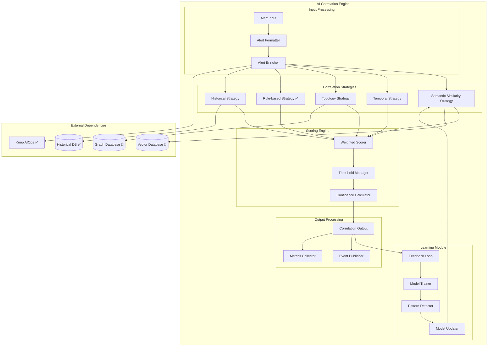

**Component Specifications:**

| Component | Technology | Purpose | Status |
|-----------|------------|---------|---------|
| **Semantic Similarity** | Python + SentenceBERT | Vector-based alert matching | 🚀 New |
| **Temporal Strategy** | Go | Time-window correlation | 🚀 New |
| **Topology Strategy** | Go + Neo4j | Infrastructure-aware correlation | 🚀 New |
| **Rule-based Strategy** | Go | Current correlation logic | ✅ Existing |
| **Weighted Scorer** | Go | Multi-strategy score aggregation | 🚀 New |

### 2. AI Investigation Engine 🚀 (NEW)

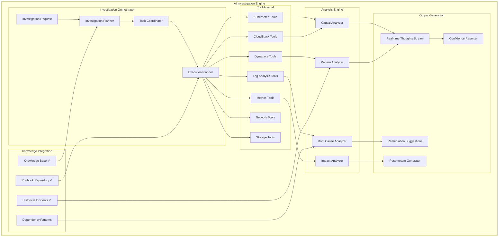

### 3. Topology Knowledge Graph 🚀 (NEW)

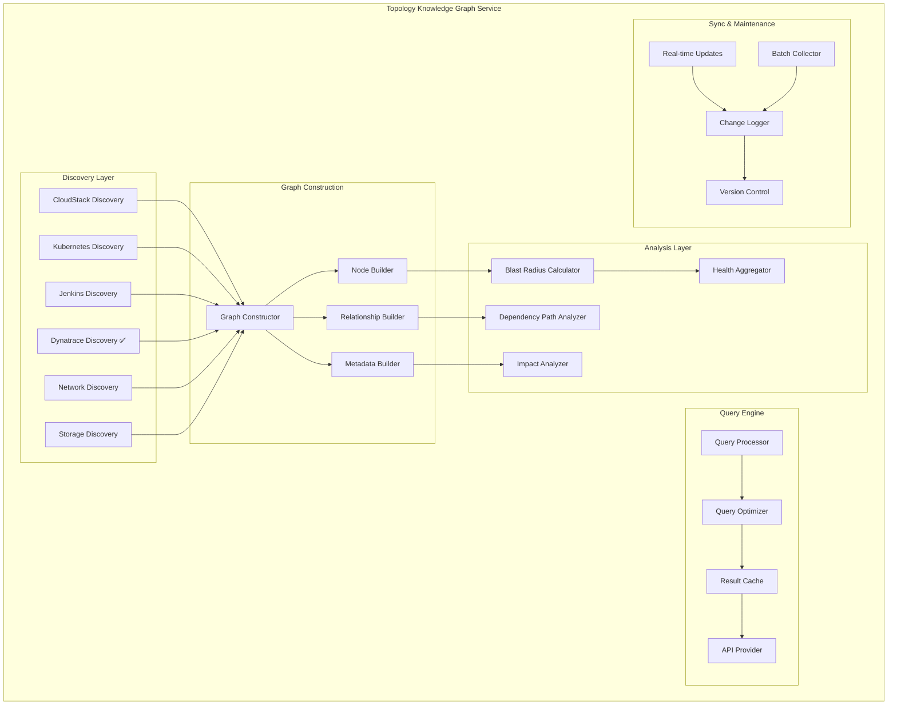

### 4. Enhanced Frontend Components 🚀 (NEW)

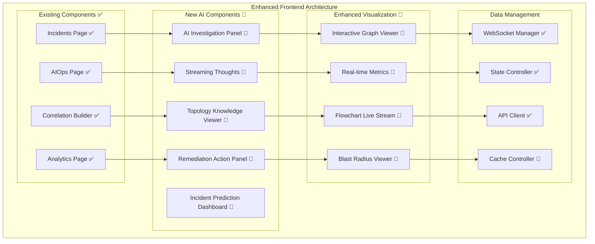

---

## Algorithm Specifications

### 1. Multi-Strategy Correlation Algorithm

```go
// AI Correlation Engine Core Algorithm
type CorrelationEngine struct {
    strategies []CorrelationStrategy
    weights    map[string]float64
    threshold  float64
}

func (ce *CorrelationEngine) CorrelateAlert(alert Alert, incidents []Incident) CorrelationResult {
    var bestMatch CorrelationResult
    
    for _, incident := range incidents {
        scores := make(map[string]float64)
        
        // Execute each correlation strategy
        for _, strategy := range ce.strategies {
            score := strategy.Calculate(alert, incident)
            scores[strategy.Name()] = score
        }
        
        // Calculate weighted final score
        weightedScore := ce.calculateWeightedScore(scores)
        
        if weightedScore > bestMatch.Score && weightedScore >= ce.threshold {
            bestMatch = CorrelationResult{
                IncidentID:     incident.ID,
                Score:         weightedScore,
                Strategy:      ce.getDominantStrategy(scores),
                Details:       scores,
                Confidence:    ce.calculateConfidence(scores),
                IsCorrelated:  true,
            }
        }
    }
    
    return bestMatch
}

func (ce *CorrelationEngine) calculateWeightedScore(scores map[string]float64) float64 {
    var totalScore, totalWeight float64
    
    for strategy, score := range scores {
        weight := ce.weights[strategy]
        totalScore += score * weight
        totalWeight += weight
    }
    
    if totalWeight == 0 {
        return 0
    }
    
    return totalScore / totalWeight
}
```

### 2. Semantic Similarity Strategy Algorithm

```python
# Vector-based Semantic Similarity
class SemanticSimilarityStrategy:
    def __init__(self):
        self.model = SentenceTransformer('all-MiniLM-L6-v2')
        self.cache = LRUCache(maxsize=10000)
    
    def calculate(self, alert: Alert, incident: Incident) -> float:
        # Get cached embeddings or compute new ones
        alert_vector = self._get_embedding(alert.description)
        incident_vector = self._get_embedding(incident.description)
        
        # Calculate cosine similarity
        similarity = cosine_similarity(
            alert_vector.reshape(1, -1),
            incident_vector.reshape(1, -1)
        )[0][0]
        
        # Apply service name boost
        service_boost = self._calculate_service_boost(alert, incident)
        
        # Final score with boost
        final_score = similarity * (1 + service_boost)
        
        return min(final_score, 1.0)
    
    def _get_embedding(self, text: str) -> np.ndarray:
        cache_key = hashlib.md5(text.encode()).hexdigest()
        
        if cache_key in self.cache:
            return self.cache[cache_key]
        
        embedding = self.model.encode(text)
        self.cache[cache_key] = embedding
        
        return embedding
    
    def _calculate_service_boost(self, alert: Alert, incident: Incident) -> float:
        if alert.service == incident.service:
            return 0.2  # 20% boost for same service
        
        # Check service dependencies
        if self._are_services_related(alert.service, incident.service):
            return 0.1  # 10% boost for related services
        
        return 0.0
```

### 3. Topology-Aware Correlation Algorithm

```go
// Topology Strategy using Graph Database
type TopologyStrategy struct {
    graphDB GraphDatabase
    cache   *cache.Cache
}

func (ts *TopologyStrategy) Calculate(alert Alert, incident Incident) float64 {
    alertService := alert.ServiceName
    incidentServices := incident.AffectedServices
    
    // Quick cache lookup
    cacheKey := fmt.Sprintf("topo_%s_%v", alertService, incidentServices)
    if cached, found := ts.cache.Get(cacheKey); found {
        return cached.(float64)
    }
    
    maxRelationship := 0.0
    
    for _, incidentService := range incidentServices {
        relationship := ts.calculateServiceRelationship(alertService, incidentService)
        if relationship > maxRelationship {
            maxRelationship = relationship
        }
    }
    
    // Cache the result
    ts.cache.Set(cacheKey, maxRelationship, 5*time.Minute)
    
    return maxRelationship
}

func (ts *TopologyStrategy) calculateServiceRelationship(service1, service2 string) float64 {
    if service1 == service2 {
        return 1.0 // Perfect match
    }
    
    // Query graph database for relationship
    query := `
        MATCH (s1:Service {name: $service1})-[r*1..3]-(s2:Service {name: $service2})
        RETURN 
            length(r) as distance,
            type(r[0]) as relationship_type,
            r[0].strength as strength
        ORDER BY distance ASC
        LIMIT 1
    `
    
    result := ts.graphDB.Execute(query, map[string]interface{}{
        "service1": service1,
        "service2": service2,
    })
    
    if len(result) == 0 {
        return 0.0 // No relationship found
    }
    
    distance := result[0]["distance"].(int)
    strength := result[0]["strength"].(float64)
    
    // Calculate relationship score based on distance and strength
    distanceScore := 1.0 / float64(distance)
    return distanceScore * strength
}
```

### 4. AI Investigation Algorithm

```python
# Autonomous Investigation Engine
class AIInvestigationEngine:
    def __init__(self):
        self.tools = self._initialize_tools()
        self.planner = InvestigationPlanner()
        self.executor = ToolExecutor()
    
    async def investigate_incident(self, incident: Incident) -> InvestigationResult:
        # Create investigation context
        context = InvestigationContext(
            incident=incident,
            tools_available=list(self.tools.keys()),
            discovered_evidence=[],
            hypotheses=[],
            confidence_score=0.0
        )
        
        # Generate initial investigation plan
        plan = await self.planner.create_plan(context)
        
        # Execute investigation steps
        for step in plan.steps:
            try:
                # Select optimal tool for this step
                tool = await self._select_tool(step, context)
                
                # Execute tool with parameters
                result = await self.executor.execute(tool, step.parameters)
                
                # Add evidence to context
                context.add_evidence(result)
                
                # Stream real-time thoughts
                await self._stream_thought(step, result, context)
                
                # Check if we need to adapt the plan
                if result.confidence < 0.3:
                    additional_steps = await self.planner.adapt_plan(context, result)
                    plan.steps.extend(additional_steps)
                
                # Early termination if high confidence achieved
                if context.confidence_score > 0.9:
                    break
                    
            except Exception as e:
                await self._handle_tool_error(step, e, context)
        
        # Synthesize findings
        return await self._synthesize_investigation(context)
    
    async def _select_tool(self, step: InvestigationStep, context: InvestigationContext) -> Tool:
        # Tool selection based on step type and current context
        candidates = [tool for tool in self.tools.values() if tool.can_handle(step)]
        
        if not candidates:
            raise NoSuitableToolError(f"No tool available for step: {step.type}")
        
        # Score tools based on context relevance
        scored_tools = []
        for tool in candidates:
            score = await tool.calculate_relevance_score(step, context)
            scored_tools.append((tool, score))
        
        # Return highest scoring tool
        return max(scored_tools, key=lambda x: x[1])[0]
    
    async def _stream_thought(self, step: InvestigationStep, result: ToolResult, context: InvestigationContext):
        thought = {
            "timestamp": datetime.utcnow().isoformat(),
            "step_type": step.type,
            "tool_used": result.tool_name,
            "finding": result.summary,
            "confidence": result.confidence,
            "next_action": await self._predict_next_action(context)
        }
        
        # Publish to real-time stream
        await self.publisher.publish("investigation_thoughts", thought)
```

---

## Network Flow & Communication

### 1. Alert Processing Flow

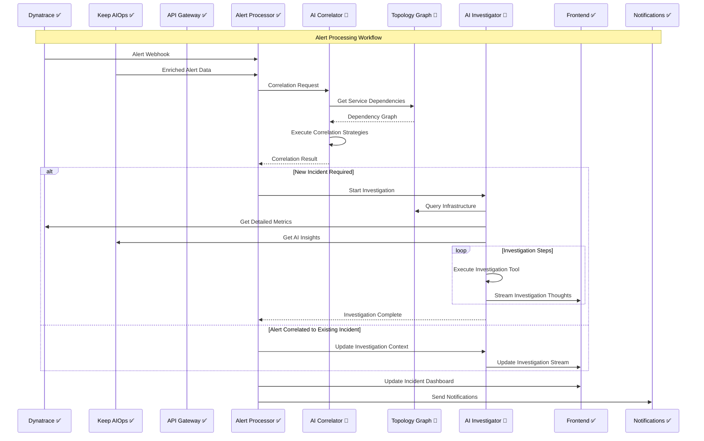

### 2. Cross-Region Synchronization Flow

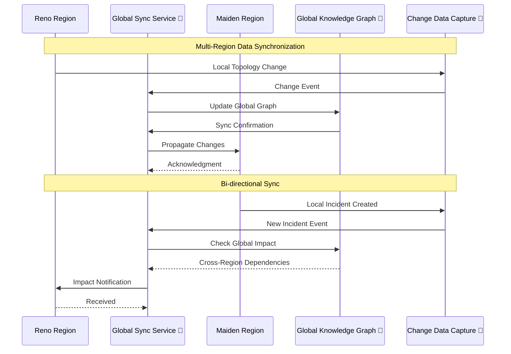

### 3. Real-time Investigation Streaming

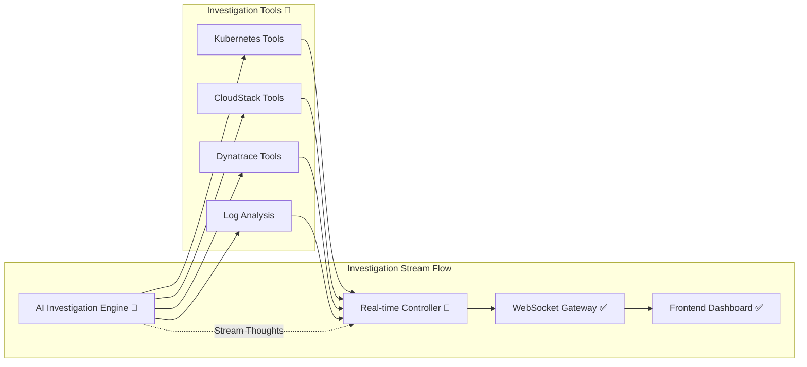

### 4. Network Architecture Diagram

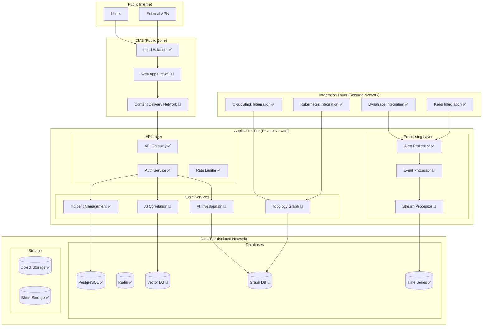

---

## Data Architecture & Storage

### 1. Database Design & Relationships

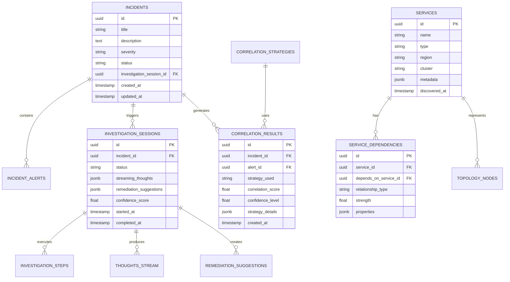

### 2. Vector Database Schema (Weaviate)

```python
# Vector Database Schema for Embeddings
vector_schema = {
    "classes": [
        {
            "class": "AlertEmbedding",
            "description": "Vector embeddings for alert descriptions",
            "vectorizer": "text2vec-transformers",
            "properties": [
                {
                    "name": "alert_id",
                    "dataType": ["string"],
                    "description": "Reference to alert ID"
                },
                {
                    "name": "description",
                    "dataType": ["text"],
                    "description": "Original alert description"
                },
                {
                    "name": "service_name",
                    "dataType": ["string"],
                    "description": "Service that generated the alert"
                },
                {
                    "name": "severity",
                    "dataType": ["string"],
                    "description": "Alert severity level"
                },
                {
                    "name": "timestamp",
                    "dataType": ["date"],
                    "description": "When the alert was created"
                }
            ]
        },
        {
            "class": "IncidentEmbedding",
            "description": "Vector embeddings for incident descriptions",
            "vectorizer": "text2vec-transformers",
            "properties": [
                {
                    "name": "incident_id",
                    "dataType": ["string"],
                    "description": "Reference to incident ID"
                },
                {
                    "name": "title",
                    "dataType": ["text"],
                    "description": "Incident title"
                },
                {
                    "name": "description",
                    "dataType": ["text"],
                    "description": "Incident description"
                },
                {
                    "name": "affected_services",
                    "dataType": ["string[]"],
                    "description": "List of affected services"
                },
                {
                    "name": "resolved",
                    "dataType": ["boolean"],
                    "description": "Whether incident is resolved"
                }
            ]
        }
    ]
}
```

### 3. Graph Database Schema (Neo4j)

```cypher
// Service Topology Schema
CREATE CONSTRAINT service_name_unique IF NOT EXISTS FOR (s:Service) REQUIRE s.name IS UNIQUE;
CREATE CONSTRAINT vm_id_unique IF NOT EXISTS FOR (vm:VirtualMachine) REQUIRE vm.id IS UNIQUE;
CREATE CONSTRAINT k8s_cluster_unique IF NOT EXISTS FOR (k:K8sCluster) REQUIRE k.name IS UNIQUE;

// Node Types
CREATE (:Service {
    name: string,
    type: "application" | "database" | "cache" | "queue",
    region: "reno" | "maiden",
    cluster: string,
    health: "healthy" | "degraded" | "critical",
    last_seen: timestamp
});

CREATE (:VirtualMachine {
    id: string,
    name: string,
    region: "reno" | "maiden",
    cloudstack_cluster: string,
    cpu_cores: int,
    memory_gb: int,
    storage_gb: int,
    status: "running" | "stopped" | "error"
});

CREATE (:K8sCluster {
    name: string,
    region: "reno" | "maiden",
    version: string,
    node_count: int,
    status: "healthy" | "degraded"
});

CREATE (:BareMetal {
    hostname: string,
    region: "reno" | "maiden",
    cpu_cores: int,
    memory_gb: int,
    storage_tb: float,
    status: "active" | "maintenance"
});

// Relationship Types
CREATE (s:Service)-[:DEPENDS_ON {
    type: "database" | "api" | "queue" | "cache",
    strength: 0.1-1.0,
    latency_ms: int,
    critical: boolean
}]->(target:Service);

CREATE (s:Service)-[:HOSTED_ON {
    port: int,
    protocol: "http" | "https" | "tcp" | "udp"
}]->(vm:VirtualMachine);

CREATE (vm:VirtualMachine)-[:RUNS_ON]->(bm:BareMetal);
CREATE (vm:VirtualMachine)-[:MANAGED_BY]->(cs:CloudStackCluster);
CREATE (s:Service)-[:DEPLOYED_IN]->(k:K8sCluster);
```

### 4. Time Series Database Schema (InfluxDB)

```sql
-- Service Metrics
CREATE MEASUREMENT service_metrics (
    time TIMESTAMP,
    service_name TAG,
    region TAG,
    cluster TAG,
    metric_type TAG,
    cpu_usage FIELD (FLOAT),
    memory_usage FIELD (FLOAT),
    disk_io FIELD (FLOAT),
    network_io FIELD (FLOAT),
    error_rate FIELD (FLOAT),
    response_time FIELD (FLOAT)
);

-- Investigation Metrics
CREATE MEASUREMENT investigation_metrics (
    time TIMESTAMP,
    session_id TAG,
    incident_id TAG,
    tool_name TAG,
    execution_time_ms FIELD (INT),
    success FIELD (BOOLEAN),
    confidence_score FIELD (FLOAT),
    findings_count FIELD (INT)
);

-- Correlation Metrics
CREATE MEASUREMENT correlation_metrics (
    time TIMESTAMP,
    strategy_name TAG,
    execution_time_ms FIELD (INT),
    score FIELD (FLOAT),
    threshold FIELD (FLOAT),
    matched FIELD (BOOLEAN)
);
```

---

## Implementation Roadmap

### Phase 1: Foundation & Core Services (Weeks 1-8)

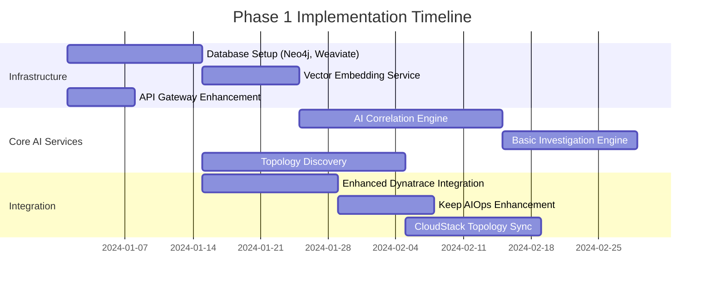

### Phase 2: Advanced AI Features (Weeks 9-16)

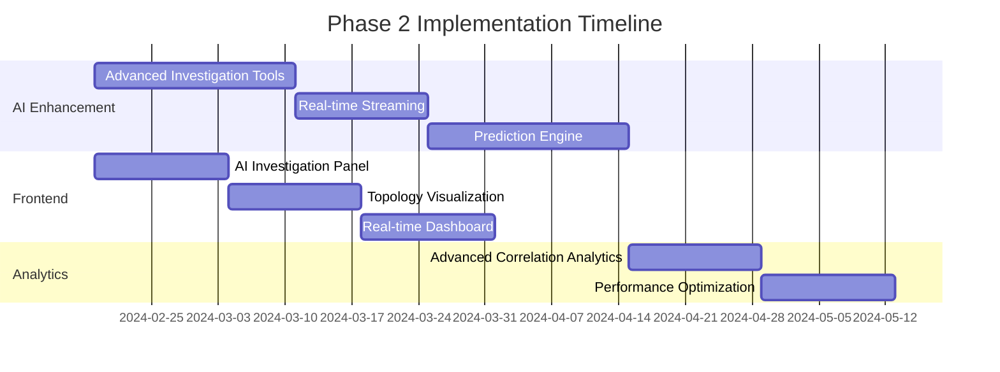

### Phase 3: Production & Optimization (Weeks 17-24)

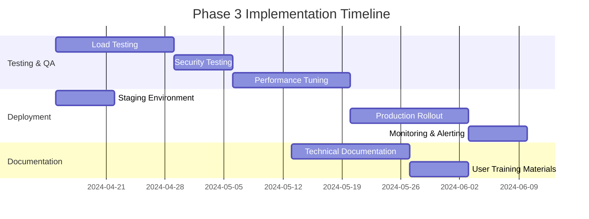

## Success Metrics & Monitoring

### Key Performance Indicators

| Metric Category | Current State | Target (6 months) | Measurement Method |
|----------------|---------------|-------------------|-------------------|
| **MTTR** | 45 minutes | 20 minutes (55% reduction) | Incident resolution time tracking |
| **Correlation Accuracy** | 65% (rule-based) | 90%+ (AI-powered) | Manual validation of correlations |
| **False Positives** | 25% | <8% | Weekly correlation quality review |
| **Investigation Speed** | 30 minutes manual | 5 minutes automated | Time from alert to root cause |
| **Auto-Resolution Rate** | 5% | 35% | Incidents resolved without human intervention |
| **Cross-Region Visibility** | Limited | 100% | Topology coverage metrics |
| **Engineer Productivity** | Baseline | +60% | Time spent on reactive vs proactive work |

### Monitoring Dashboard Design

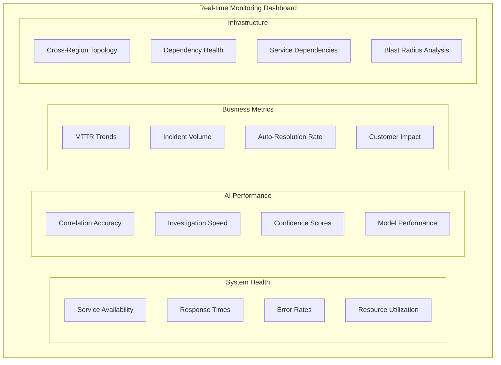

This comprehensive architecture document provides the detailed microservices design, component specifications, algorithms, and implementation roadmap needed to transform Alerthub Enterprise into an AI-powered AIOps platform while clearly distinguishing between existing capabilities and planned enhancements.