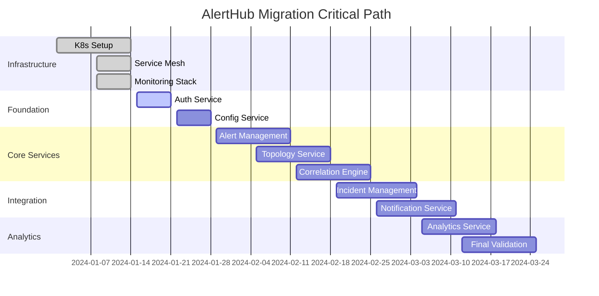

# AlertHub Enterprise Migration Strategy Guide

## Executive Summary

This comprehensive migration strategy guide provides a detailed roadmap for transitioning AlertHub Enterprise from a monolithic architecture to a microservices-based architecture. The migration is designed to ensure zero-downtime deployment, data integrity, and seamless user experience while maintaining full system functionality throughout the transition.

## Table of Contents

1. [Migration Overview](#migration-overview)
2. [Pre-Migration Assessment](#pre-migration-assessment)
3. [Migration Architecture](#migration-architecture)
4. [Data Migration Strategy](#data-migration-strategy)
5. [Service Cutover Procedures](#service-cutover-procedures)
6. [Rollback Strategies](#rollback-strategies)
7. [Risk Assessment & Mitigation](#risk-assessment--mitigation)
8. [Performance Benchmarking](#performance-benchmarking)
9. [Timeline & Phases](#timeline--phases)
10. [Post-Migration Validation](#post-migration-validation)

## Migration Overview

### Objectives
- **Zero-Downtime Migration**: Ensure continuous service availability during migration
- **Data Integrity**: Maintain complete data consistency and integrity
- **Performance Preservation**: Maintain or improve system performance
- **Rollback Capability**: Provide immediate rollback options at any stage
- **Gradual Transition**: Implement controlled, incremental migration

### Migration Approach
We employ a **Strangler Fig Pattern** combined with **Blue-Green Deployment** strategy:

1. **Strangler Fig Pattern**: Gradually replace monolith components with microservices
2. **Blue-Green Deployment**: Maintain parallel environments for safe transitions
3. **Canary Releases**: Test microservices with limited traffic before full cutover
4. **Database-First Migration**: Migrate data layer before application layer

## Pre-Migration Assessment

### Current State Analysis

#### Monolith Architecture Assessment
```
AlertHub Monolith Components:
├── Authentication Service
├── Alert Management
├── Incident Management
├── Configuration Management
├── Topology Discovery
├── Correlation Engine
├── Notification Service
├── Analytics Service
├── Reporting Engine
└── Web Interface
```

#### Database Schema Analysis
```sql
-- Current Database Tables
Core Tables:
- alerts (5M+ records)
- incidents (500K+ records)
- users (10K+ records)
- configurations (1K+ records)
- topology_nodes (100K+ records)
- correlations (2M+ records)
- notifications (10M+ records)
- analytics_data (50M+ records)

Dependencies:
- Foreign key relationships
- Stored procedures
- Views and materialized views
- Triggers and constraints
```

#### Performance Baseline
```
Current Performance Metrics:
- Response Time (P95): 1.2s
- Throughput: 1,000 RPS
- Database Connections: 50-80
- Memory Usage: 8GB
- CPU Usage: 60-70%
- Uptime: 99.5%
```

### Readiness Checklist

#### Infrastructure Prerequisites
- [x] Kubernetes cluster provisioned and configured
- [x] Service mesh (Istio) deployed and tested
- [x] Monitoring stack (Prometheus/Grafana) operational
- [x] CI/CD pipelines configured for microservices
- [x] Container registry setup and secured
- [x] Database cluster (PostgreSQL) deployed with replication
- [x] Message queue (RabbitMQ) cluster operational
- [x] Redis cluster for caching deployed

#### Team Readiness
- [x] Team training on microservices architecture completed
- [x] DevOps team familiar with Kubernetes operations
- [x] Database migration procedures tested
- [x] Rollback procedures documented and tested
- [x] Communication plan established
- [x] Emergency contacts and escalation paths defined

## Migration Architecture

### Target Microservices Architecture

```
┌─────────────────────┐    ┌─────────────────────┐
│   API Gateway       │    │   Web Frontend      │
│   (Istio Ingress)   │    │   (React SPA)       │
└─────────┬───────────┘    └─────────────────────┘
          │
          ▼
┌─────────────────────────────────────────────────┐
│                Service Mesh                     │
│                 (Istio)                         │
└─────────┬───────────────────────────────────────┘
          │
    ┌─────┴─────┐
    ▼           ▼
┌─────────┐ ┌─────────┐ ┌─────────┐ ┌─────────┐
│  Auth   │ │ Alert   │ │ Config  │ │Topology │
│Service  │ │ Mgmt    │ │ Mgmt    │ │Knowledge│
└─────────┘ └─────────┘ └─────────┘ └─────────┘
┌─────────┐ ┌─────────┐ ┌─────────┐ ┌─────────┐
│Correlate│ │ Notify  │ │Analytics│ │Incident │
│ Engine  │ │ Service │ │ Service │ │ Mgmt    │
└─────────┘ └─────────┘ └─────────┘ └─────────┘
          │
          ▼
┌─────────────────────────────────────────────────┐
│             Data Layer                          │
├─────────────┬─────────────┬─────────────────────┤
│ PostgreSQL  │ Redis Cache │ Message Queue       │
│ Cluster     │ Cluster     │ (RabbitMQ)          │
└─────────────┴─────────────┴─────────────────────┘
```

### Service Decomposition Strategy

#### Phase 1: Infrastructure Services
1. **Authentication Service**
   - JWT token management
   - User authentication/authorization
   - RBAC enforcement

2. **Configuration Management Service**
   - System configuration
   - Feature flags
   - Environment-specific settings

#### Phase 2: Core Business Services
3. **Alert Management Service**
   - Alert ingestion and processing
   - Alert lifecycle management
   - Alert enrichment

4. **Topology Knowledge Service**
   - Service discovery
   - Dependency mapping
   - Health monitoring

#### Phase 3: Advanced Services
5. **Correlation Engine Service**
   - Alert correlation logic
   - Pattern recognition
   - Machine learning models

6. **Incident Management Service**
   - Incident lifecycle
   - Escalation procedures
   - Resolution tracking

#### Phase 4: Integration Services
7. **Notification Service**
   - Multi-channel notifications
   - Delivery confirmation
   - Template management

8. **Analytics Service**
   - Metrics collection
   - Report generation
   - Data visualization

## Data Migration Strategy

### Database Migration Approach

#### 1. Database Replication Setup
```sql
-- Setup logical replication for zero-downtime migration
-- On source database (monolith)
ALTER SYSTEM SET wal_level = logical;
SELECT pg_create_logical_replication_slot('migration_slot', 'pgoutput');

-- Create publication for all tables
CREATE PUBLICATION migration_pub FOR ALL TABLES;

-- On target database (microservices)
-- Create subscription for real-time sync
CREATE SUBSCRIPTION migration_sub 
CONNECTION 'host=monolith-db port=5432 dbname=alerthub user=replication_user'
PUBLICATION migration_pub
WITH (slot_name = migration_slot);
```

#### 2. Schema Decomposition
```sql
-- Microservice-specific schema separation

-- Auth Service Database
CREATE DATABASE auth_service;
-- Tables: users, roles, permissions, sessions, oauth_tokens

-- Alert Management Database  
CREATE DATABASE alert_management;
-- Tables: alerts, alert_rules, alert_history, alert_tags

-- Configuration Management Database
CREATE DATABASE config_management;
-- Tables: configurations, feature_flags, environments

-- Topology Knowledge Database
CREATE DATABASE topology_knowledge;
-- Tables: services, dependencies, health_checks, topology_map

-- Correlation Engine Database
CREATE DATABASE correlation_engine;
-- Tables: correlation_rules, patterns, ml_models, correlations

-- Incident Management Database
CREATE DATABASE incident_management;
-- Tables: incidents, escalations, resolutions, incident_history

-- Notification Service Database
CREATE DATABASE notification_service;
-- Tables: notification_templates, delivery_logs, channels

-- Analytics Service Database
CREATE DATABASE analytics_service;  
-- Tables: metrics, reports, dashboards, analytics_data
```

#### 3. Data Synchronization Strategy

```bash
#!/bin/bash
# Data synchronization script for migration

# Phase 1: Initial data sync
echo "Starting initial data synchronization..."

# Sync user data to auth service
pg_dump --host=monolith-db --table=users --data-only --inserts | \
psql --host=auth-service-db --dbname=auth_service

# Sync alerts data to alert management service
pg_dump --host=monolith-db --table=alerts --data-only --inserts | \
psql --host=alert-mgmt-db --dbname=alert_management

# Continue for all services...

# Phase 2: Real-time synchronization
echo "Setting up real-time synchronization..."

# Start logical replication for each service database
# Monitor replication lag and ensure consistency

# Phase 3: Validation
echo "Validating data synchronization..."

# Compare record counts
SOURCE_USERS=$(psql --host=monolith-db -t -c "SELECT COUNT(*) FROM users")
TARGET_USERS=$(psql --host=auth-service-db -t -c "SELECT COUNT(*) FROM users")

if [ "$SOURCE_USERS" -eq "$TARGET_USERS" ]; then
    echo "✓ User data synchronization validated"
else
    echo "✗ User data synchronization validation failed"
    exit 1
fi
```

### Data Migration Phases

#### Phase 1: Reference Data Migration (Week 1)
- **Scope**: Users, roles, configurations, static data
- **Method**: Bulk copy with validation
- **Downtime**: None (read-only operations)
- **Rollback**: Re-run copy process

#### Phase 2: Transactional Data Migration (Week 2-3)
- **Scope**: Alerts, incidents, correlations
- **Method**: Logical replication with lag monitoring
- **Downtime**: None (real-time sync)
- **Rollback**: Switch back to source database

#### Phase 3: Analytics Data Migration (Week 4)
- **Scope**: Historical metrics, reports, analytics
- **Method**: Batch processing with parallel workers
- **Downtime**: Analytics features only
- **Rollback**: Restore from backup

## Service Cutover Procedures

### Cutover Strategy Overview

We implement a **gradual traffic shifting** approach using Istio service mesh:

1. **0% Traffic**: Deploy microservice, no live traffic
2. **5% Traffic**: Canary deployment with monitoring
3. **25% Traffic**: Expanded canary with validation
4. **50% Traffic**: Half traffic split with comparison
5. **75% Traffic**: Majority traffic to microservice
6. **100% Traffic**: Complete cutover to microservice

### Detailed Cutover Procedure

#### Pre-Cutover Checklist
```bash
# Pre-cutover validation script
#!/bin/bash

echo "Starting pre-cutover validation..."

# 1. Verify microservice health
kubectl get pods -n alerthub -l app=auth-service
kubectl rollout status deployment/auth-service -n alerthub

# 2. Validate database connectivity
kubectl exec -n alerthub deployment/auth-service -- \
  pg_isready -h auth-service-db -p 5432

# 3. Check data synchronization lag
REPLICATION_LAG=$(kubectl exec -n alerthub deployment/auth-service -- \
  psql -h auth-service-db -t -c \
  "SELECT EXTRACT(EPOCH FROM (now() - pg_last_xact_replay_timestamp()))")

if (( $(echo "$REPLICATION_LAG < 60" | bc -l) )); then
    echo "✓ Replication lag acceptable: ${REPLICATION_LAG}s"
else
    echo "✗ Replication lag too high: ${REPLICATION_LAG}s"
    exit 1
fi

# 4. Run smoke tests
./scripts/deploy/validation/smoke-tests.sh alerthub production

echo "Pre-cutover validation completed successfully"
```

#### Traffic Shifting Configuration
```yaml
# Istio VirtualService for gradual traffic shifting
apiVersion: networking.istio.io/v1beta1
kind: VirtualService
metadata:
  name: auth-service-traffic-split
  namespace: alerthub
spec:
  hosts:
  - auth-service
  http:
  - match:
    - headers:
        x-canary-auth:
          exact: "microservice"
    route:
    - destination:
        host: auth-service-microservice
        subset: v2
  - route:
    - destination:
        host: auth-service-monolith
        subset: v1
      weight: 95  # Gradually decrease: 100->95->75->50->25->0
    - destination:
        host: auth-service-microservice
        subset: v2
      weight: 5   # Gradually increase: 0->5->25->50->75->100
```

#### Cutover Automation Script
```bash
#!/bin/bash
# Automated cutover script with validation

SERVICE_NAME="auth-service"
NAMESPACE="alerthub"
CURRENT_TRAFFIC=0
TARGET_TRAFFIC=100
TRAFFIC_INCREMENT=25
VALIDATION_WAIT=300  # 5 minutes

cutover_service() {
    local service=$1
    local current_weight=$2
    local target_weight=$3
    
    echo "Shifting traffic for ${service}: ${current_weight}% -> ${target_weight}%"
    
    # Update VirtualService weights
    kubectl patch virtualservice "${service}-traffic-split" -n "${NAMESPACE}" \
        --type='json' \
        -p="[
            {'op': 'replace', 'path': '/spec/http/0/route/0/weight', 'value': $((100 - target_weight))},
            {'op': 'replace', 'path': '/spec/http/0/route/1/weight', 'value': ${target_weight}}
        ]"
    
    echo "Waiting ${VALIDATION_WAIT}s for traffic to stabilize..."
    sleep "${VALIDATION_WAIT}"
    
    # Validate service health
    validate_service_health "${service}"
    
    # Check error rates
    validate_error_rates "${service}" "${target_weight}"
    
    echo "Traffic shift to ${target_weight}% completed successfully"
}

validate_service_health() {
    local service=$1
    
    # Check pod health
    kubectl get pods -n "${NAMESPACE}" -l "app=${service}" --no-headers | \
        grep -q "Running" || {
            echo "ERROR: ${service} pods not healthy"
            return 1
        }
    
    # Check service endpoints
    kubectl get endpoints "${service}" -n "${NAMESPACE}" -o json | \
        jq -r '.subsets[].addresses | length' | \
        grep -q -v "^0$" || {
            echo "ERROR: ${service} has no healthy endpoints"
            return 1
        }
    
    echo "✓ ${service} health validation passed"
}

validate_error_rates() {
    local service=$1
    local traffic_percentage=$2
    
    # Query Prometheus for error rate
    local error_rate=$(curl -s "http://prometheus:9090/api/v1/query" \
        --data-urlencode "query=rate(http_requests_total{service=\"${service}\",code!~\"2..\"}[5m])/rate(http_requests_total{service=\"${service}\"}[5m])" | \
        jq -r '.data.result[0].value[1] // "0"')
    
    # Check if error rate is acceptable (< 1%)
    if (( $(echo "${error_rate} < 0.01" | bc -l) )); then
        echo "✓ ${service} error rate acceptable: $(echo "${error_rate} * 100" | bc -l)%"
    else
        echo "✗ ${service} error rate too high: $(echo "${error_rate} * 100" | bc -l)%"
        echo "Initiating rollback..."
        rollback_traffic_shift "${service}" "${traffic_percentage}" "${CURRENT_TRAFFIC}"
        exit 1
    fi
}

# Main cutover loop
while [ "${CURRENT_TRAFFIC}" -lt "${TARGET_TRAFFIC}" ]; do
    NEXT_TRAFFIC=$((CURRENT_TRAFFIC + TRAFFIC_INCREMENT))
    
    if [ "${NEXT_TRAFFIC}" -gt "${TARGET_TRAFFIC}" ]; then
        NEXT_TRAFFIC="${TARGET_TRAFFIC}"
    fi
    
    cutover_service "${SERVICE_NAME}" "${CURRENT_TRAFFIC}" "${NEXT_TRAFFIC}"
    CURRENT_TRAFFIC="${NEXT_TRAFFIC}"
done

echo "Complete cutover to microservice completed successfully!"
```

### Per-Service Cutover Timeline

#### Week 1: Authentication Service
- **Day 1-2**: Deploy auth microservice (0% traffic)
- **Day 3**: Enable 5% canary traffic
- **Day 4**: Increase to 25% traffic
- **Day 5**: Increase to 50% traffic
- **Day 6**: Increase to 75% traffic
- **Day 7**: Complete cutover to 100%

#### Week 2: Configuration Management Service
- **Day 1-2**: Deploy config microservice
- **Day 3-7**: Gradual traffic shift (5%->25%->50%->75%->100%)

#### Week 3-4: Alert Management Service
- **Extended timeline due to high traffic volume**
- **Extensive validation at each traffic level**

#### Week 5-8: Remaining Services
- **Parallel deployment where dependencies allow**
- **Coordinated cutover for interdependent services**

## Rollback Strategies

### Immediate Rollback Triggers

#### Automated Rollback Conditions
1. **Error Rate Threshold**: >1% for 5 consecutive minutes
2. **Response Time Degradation**: >50% increase in P95 latency
3. **Service Unavailability**: Service down for >30 seconds
4. **Data Inconsistency**: Detected data corruption or loss
5. **Critical Bug Discovery**: Functional regression discovered

#### Manual Rollback Scenarios
1. **Business Impact**: Significant business process disruption
2. **Performance Degradation**: Unacceptable system slowdown
3. **Security Incident**: Security vulnerability discovered
4. **Team Decision**: Stakeholder decision to rollback

### Rollback Procedures

#### Traffic Rollback (Fastest - ~30 seconds)
```bash
#!/bin/bash
# Immediate traffic rollback script

SERVICE_NAME="$1"
NAMESPACE="alerthub"

echo "EMERGENCY ROLLBACK: Reverting all traffic to monolith for ${SERVICE_NAME}"

# Immediately set traffic to 100% monolith, 0% microservice
kubectl patch virtualservice "${SERVICE_NAME}-traffic-split" -n "${NAMESPACE}" \
    --type='json' \
    -p='[
        {"op": "replace", "path": "/spec/http/0/route/0/weight", "value": 100},
        {"op": "replace", "path": "/spec/http/0/route/1/weight", "value": 0}
    ]'

echo "Traffic rollback completed. Monitoring system recovery..."

# Wait for traffic to stabilize
sleep 60

# Validate monolith health
validate_monolith_health "${SERVICE_NAME}"

echo "Emergency rollback completed successfully"
```

#### Database Rollback (Moderate - ~5-15 minutes)
```bash
#!/bin/bash
# Database rollback procedure

SERVICE_NAME="$1"
ROLLBACK_TIMESTAMP="$2"  # Format: YYYY-MM-DD HH:MM:SS

echo "Starting database rollback for ${SERVICE_NAME} to ${ROLLBACK_TIMESTAMP}"

# 1. Stop replication to microservice database
kubectl exec -n alerthub deployment/"${SERVICE_NAME}" -- \
    psql -h "${SERVICE_NAME}-db" -c "DROP SUBSCRIPTION IF EXISTS migration_sub"

# 2. Point microservice back to monolith database temporarily
kubectl patch deployment "${SERVICE_NAME}" -n alerthub \
    --type='json' \
    -p='[{
        "op": "replace", 
        "path": "/spec/template/spec/containers/0/env",
        "value": [{"name": "DATABASE_URL", "value": "postgresql://monolith-db:5432/alerthub"}]
    }]'

# 3. Restore monolith database to specific timestamp (if needed)
if [ -n "${ROLLBACK_TIMESTAMP}" ]; then
    echo "Restoring database to ${ROLLBACK_TIMESTAMP}..."
    # This would use point-in-time recovery procedures
    kubectl exec -n alerthub deployment/postgresql-monolith -- \
        psql -c "SELECT pg_cancel_backend(pid) FROM pg_stat_activity WHERE datname='alerthub' AND pid <> pg_backend_pid()"
    
    # Restore from backup (implementation depends on backup strategy)
    restore_database_to_timestamp "${ROLLBACK_TIMESTAMP}"
fi

# 4. Restart services
kubectl rollout restart deployment/"${SERVICE_NAME}" -n alerthub
kubectl rollout restart deployment/monolith -n alerthub

echo "Database rollback completed"
```

#### Full System Rollback (Comprehensive - ~30-60 minutes)
```bash
#!/bin/bash
# Complete system rollback to monolith

echo "Starting complete system rollback to monolith architecture"

# 1. Set all traffic to monolith
for service in auth-service alert-management config-management topology-knowledge correlation-engine incident-management notification-service analytics-service; do
    echo "Rolling back traffic for ${service}..."
    kubectl patch virtualservice "${service}-traffic-split" -n alerthub \
        --type='json' \
        -p='[
            {"op": "replace", "path": "/spec/http/0/route/0/weight", "value": 100},
            {"op": "replace", "path": "/spec/http/0/route/1/weight", "value": 0}
        ]'
done

# 2. Scale down all microservices
kubectl scale deployments --all --replicas=0 -n alerthub --selector=tier=microservice

# 3. Restore monolith database from backup
restore_monolith_database

# 4. Scale up monolith
kubectl scale deployment monolith --replicas=3 -n alerthub

# 5. Wait for monolith to be ready
kubectl rollout status deployment/monolith -n alerthub --timeout=600s

# 6. Validate monolith functionality
./scripts/deploy/validation/smoke-tests.sh alerthub production --monolith-mode

echo "Complete system rollback completed successfully"
```

### Rollback Decision Matrix

| Severity | Issue Type | Rollback Method | Time to Execute | Risk Level |
|----------|------------|----------------|-----------------|------------|
| P0 | Service Down | Traffic Rollback | 30 seconds | Low |
| P0 | Data Loss | Database + Traffic | 15 minutes | Medium |
| P1 | Performance Degradation | Traffic Rollback | 30 seconds | Low |
| P1 | Functional Regression | Traffic + Code Rollback | 10 minutes | Medium |
| P2 | Minor Issues | Planned Rollback | 30 minutes | Low |
| P0 | System Compromise | Full System Rollback | 60 minutes | High |

## Risk Assessment & Mitigation

### High-Risk Scenarios

#### 1. Data Loss During Migration
**Risk Level**: HIGH
**Impact**: Critical business data loss
**Probability**: Low (with proper procedures)

**Mitigation Strategies**:
- Continuous database replication with lag monitoring
- Multiple backup points throughout migration
- Data validation at each migration step
- Read-only migration phases to prevent writes during critical operations
- Automated rollback on data consistency failures

#### 2. Service Downtime During Cutover
**Risk Level**: MEDIUM
**Impact**: Service unavailability during business hours
**Probability**: Medium

**Mitigation Strategies**:
- Blue-green deployment strategy
- Canary releases with automatic rollback
- Health check validation before traffic shifts
- Immediate traffic rollback capabilities
- Off-hours migration scheduling for critical services

#### 3. Performance Degradation
**Risk Level**: MEDIUM
**Impact**: Slower response times affecting user experience
**Probability**: Medium

**Mitigation Strategies**:
- Performance baseline establishment
- Real-time performance monitoring during migration
- Automated performance regression detection
- Resource scaling capabilities
- Performance-based rollback triggers

#### 4. Integration Failures
**Risk Level**: MEDIUM
**Impact**: Inter-service communication failures
**Probability**: Medium

**Mitigation Strategies**:
- Comprehensive integration testing
- Service mesh for reliable communication
- Circuit breaker patterns
- Retry mechanisms with exponential backoff
- Fallback to monolith for failed integrations

### Risk Monitoring

#### Real-Time Monitoring Dashboard
```yaml
# Grafana Dashboard Configuration for Migration Monitoring
dashboards:
  - name: "Migration Health Dashboard"
    panels:
      - title: "Service Health Status"
        type: "stat"
        targets:
          - expr: 'up{job="kubernetes-pods", namespace="alerthub"}'
      
      - title: "Error Rate Trend"
        type: "graph"
        targets:
          - expr: 'rate(http_requests_total{code!~"2.."}[5m])'
      
      - title: "Response Time Percentiles"
        type: "graph"
        targets:
          - expr: 'histogram_quantile(0.95, rate(http_request_duration_seconds_bucket[5m]))'
          - expr: 'histogram_quantile(0.99, rate(http_request_duration_seconds_bucket[5m]))'
      
      - title: "Database Replication Lag"
        type: "graph"
        targets:
          - expr: 'postgresql_replication_lag_seconds'
      
      - title: "Traffic Distribution"
        type: "pie"
        targets:
          - expr: 'sum by (destination_service_name) (rate(istio_requests_total[5m]))'
```

## Performance Benchmarking

### Baseline Metrics Collection

#### Pre-Migration Performance Baseline
```bash
#!/bin/bash
# Performance baseline collection script

echo "Collecting pre-migration performance baseline..."

# 1. Application Performance Metrics
echo "=== Application Performance ===" > baseline-report.txt
curl -s "http://prometheus:9090/api/v1/query_range" \
    --data-urlencode "query=histogram_quantile(0.95, rate(http_request_duration_seconds_bucket[5m]))" \
    --data-urlencode "start=$(date -d '24 hours ago' -u +%s)" \
    --data-urlencode "end=$(date -u +%s)" \
    --data-urlencode "step=300" | \
    jq -r '.data.result[].values[] | "\(.[0]) \(.[1])"' >> baseline-report.txt

# 2. Database Performance Metrics
echo "=== Database Performance ===" >> baseline-report.txt
kubectl exec -n alerthub deployment/postgresql-monolith -- \
    psql -c "SELECT 
        schemaname,
        tablename,
        n_tup_ins + n_tup_upd + n_tup_del as total_operations,
        n_tup_ins,
        n_tup_upd,
        n_tup_del,
        seq_scan,
        idx_scan
    FROM pg_stat_user_tables 
    ORDER BY total_operations DESC 
    LIMIT 10" >> baseline-report.txt

# 3. Resource Utilization
echo "=== Resource Utilization ===" >> baseline-report.txt
kubectl top nodes >> baseline-report.txt
kubectl top pods -n alerthub >> baseline-report.txt

echo "Baseline collection completed: baseline-report.txt"
```

#### Migration Performance Comparison
```bash
#!/bin/bash
# Performance comparison during migration

SERVICE_NAME="$1"
MIGRATION_PHASE="$2"

echo "Collecting performance metrics for ${SERVICE_NAME} during ${MIGRATION_PHASE}"

# Create comparison report
REPORT_FILE="performance-comparison-${SERVICE_NAME}-$(date +%Y%m%d-%H%M%S).txt"

# 1. Response Time Comparison
echo "=== Response Time Comparison ===" > "${REPORT_FILE}"
echo "Monolith vs Microservice Response Times" >> "${REPORT_FILE}"

# Query monolith response times
MONOLITH_P95=$(curl -s "http://prometheus:9090/api/v1/query" \
    --data-urlencode "query=histogram_quantile(0.95, rate(http_request_duration_seconds_bucket{service=\"monolith\",path=~\".*${SERVICE_NAME}.*\"}[5m]))" | \
    jq -r '.data.result[0].value[1] // "0"')

# Query microservice response times
MICROSERVICE_P95=$(curl -s "http://prometheus:9090/api/v1/query" \
    --data-urlencode "query=histogram_quantile(0.95, rate(http_request_duration_seconds_bucket{service=\"${SERVICE_NAME}\"}[5m]))" | \
    jq -r '.data.result[0].value[1] // "0"')

echo "Monolith P95: ${MONOLITH_P95}s" >> "${REPORT_FILE}"
echo "Microservice P95: ${MICROSERVICE_P95}s" >> "${REPORT_FILE}"

# Calculate improvement/degradation
IMPROVEMENT=$(echo "scale=2; (${MONOLITH_P95} - ${MICROSERVICE_P95}) / ${MONOLITH_P95} * 100" | bc -l)
echo "Performance Change: ${IMPROVEMENT}%" >> "${REPORT_FILE}"

# 2. Throughput Comparison
echo "=== Throughput Comparison ===" >> "${REPORT_FILE}"
MONOLITH_RPS=$(curl -s "http://prometheus:9090/api/v1/query" \
    --data-urlencode "query=rate(http_requests_total{service=\"monolith\"}[5m])" | \
    jq -r '.data.result[0].value[1] // "0"')

MICROSERVICE_RPS=$(curl -s "http://prometheus:9090/api/v1/query" \
    --data-urlencode "query=rate(http_requests_total{service=\"${SERVICE_NAME}\"}[5m])" | \
    jq -r '.data.result[0].value[1] // "0"')

echo "Monolith RPS: ${MONOLITH_RPS}" >> "${REPORT_FILE}"
echo "Microservice RPS: ${MICROSERVICE_RPS}" >> "${REPORT_FILE}"

# 3. Resource Usage Comparison
echo "=== Resource Usage Comparison ===" >> "${REPORT_FILE}"
kubectl top pods -n alerthub -l app=monolith >> "${REPORT_FILE}"
kubectl top pods -n alerthub -l app="${SERVICE_NAME}" >> "${REPORT_FILE}"

echo "Performance comparison completed: ${REPORT_FILE}"
```

### Performance Validation Gates

#### Automated Performance Gates
```yaml
# Performance validation rules
performance_gates:
  response_time:
    p95_threshold: 2.0s  # 95th percentile must be under 2 seconds
    p99_threshold: 5.0s  # 99th percentile must be under 5 seconds
    
  throughput:
    min_rps: 500         # Minimum 500 requests per second
    degradation_limit: 10% # Max 10% throughput degradation
    
  error_rate:
    max_error_rate: 0.1%  # Maximum 0.1% error rate
    
  resource_usage:
    cpu_limit: 80%        # Maximum 80% CPU usage
    memory_limit: 85%     # Maximum 85% memory usage
    
  database:
    connection_limit: 80  # Maximum 80 database connections
    query_time_p95: 500ms # 95th percentile query time under 500ms
```

## Timeline & Phases

### Overall Migration Timeline: 12 Weeks

#### Phase 1: Infrastructure Preparation (Weeks 1-2)
**Objectives**: Set up target infrastructure and validate readiness

**Week 1**:
- [x] Kubernetes cluster setup and configuration
- [x] Service mesh (Istio) deployment
- [x] Monitoring stack deployment
- [x] CI/CD pipeline setup
- [x] Container registry configuration

**Week 2**:
- [x] Database cluster setup with replication
- [x] Message queue deployment
- [x] Redis cluster setup
- [x] Security hardening and network policies
- [x] Initial data synchronization setup

**Deliverables**:
- ✅ Production-ready Kubernetes infrastructure
- ✅ Monitoring and observability stack
- ✅ CI/CD pipelines for microservices
- ✅ Database replication infrastructure

#### Phase 2: Foundation Services Migration (Weeks 3-4)
**Objectives**: Migrate infrastructure and configuration services

**Week 3: Authentication Service**
- Day 1-2: Deploy auth microservice
- Day 3: 5% canary deployment
- Day 4: 25% traffic split
- Day 5: 50% traffic split
- Day 6: 75% traffic split  
- Day 7: 100% cutover completion

**Week 4: Configuration Management Service**
- Day 1-2: Deploy config microservice
- Day 3-7: Progressive traffic shifting (5%→100%)

**Deliverables**:
- ✅ Authentication service fully migrated
- ✅ Configuration management service migrated
- ✅ User authentication working via microservice
- ✅ Configuration API endpoints operational

#### Phase 3: Core Business Services Migration (Weeks 5-8)
**Objectives**: Migrate primary business logic services

**Week 5-6: Alert Management Service**
- Extended timeline due to high transaction volume
- Careful data migration with validation
- Progressive traffic shifting with extensive monitoring

**Week 7: Topology Knowledge Service**
- Service discovery migration
- Dependency mapping transfer
- Health monitoring transition

**Week 8: Correlation Engine Service**
- Complex business logic migration
- Machine learning model deployment
- Alert correlation rule transfer

**Deliverables**:
- ✅ Alert management fully operational via microservice
- ✅ Topology discovery working independently
- ✅ Correlation engine processing alerts
- ✅ All business logic preserved and validated

#### Phase 4: Integration Services Migration (Weeks 9-10)
**Objectives**: Migrate integration and notification services

**Week 9: Incident Management Service**
- Incident lifecycle management
- Escalation procedures
- Integration with alert management

**Week 10: Notification Service**
- Multi-channel notification delivery
- Template management system
- Delivery confirmation tracking

**Deliverables**:
- ✅ Incident management workflows operational
- ✅ Notification delivery systems functional
- ✅ All integrations tested and validated

#### Phase 5: Analytics and Optimization (Weeks 11-12)
**Objectives**: Complete migration and optimize performance

**Week 11: Analytics Service**
- Metrics collection migration
- Report generation system
- Dashboard data services

**Week 12: Final Optimization and Validation**
- Performance tuning and optimization
- Complete system validation
- Monolith decommissioning
- Documentation and handover

**Deliverables**:
- ✅ Analytics and reporting fully functional
- ✅ Complete system performance validated
- ✅ Monolith successfully decommissioned
- ✅ Team handover and documentation complete

### Critical Path Dependencies



## Post-Migration Validation

### Validation Framework

#### 1. Functional Validation
```bash
#!/bin/bash
# Comprehensive functional validation suite

echo "Starting post-migration functional validation..."

# Test Suite 1: Core Functionality
echo "=== Core Functionality Tests ==="
./scripts/deploy/validation/smoke-tests.sh alerthub production

# Test Suite 2: Integration Tests
echo "=== Integration Tests ==="
./scripts/deploy/validation/integration-tests.sh alerthub production

# Test Suite 3: Performance Tests
echo "=== Performance Tests ==="
./scripts/deploy/validation/performance-tests.sh alerthub production 600 100 200

# Test Suite 4: Security Tests
echo "=== Security Tests ==="
./scripts/deploy/validation/security-tests.sh alerthub production

# Test Suite 5: End-to-End User Journeys
echo "=== End-to-End User Journey Tests ==="
test_complete_alert_lifecycle
test_incident_management_workflow
test_configuration_management
test_user_authentication_flows

echo "Functional validation completed"
```

#### 2. Performance Validation
```bash
#!/bin/bash
# Performance validation against baseline

echo "Starting performance validation..."

# Load baseline metrics
source ./baseline-metrics.env

# Current performance metrics
CURRENT_P95=$(get_current_p95_response_time)
CURRENT_THROUGHPUT=$(get_current_throughput)
CURRENT_ERROR_RATE=$(get_current_error_rate)

# Validation checks
validate_metric() {
    local metric_name=$1
    local current_value=$2
    local baseline_value=$3
    local threshold_percent=$4
    
    local threshold=$(echo "scale=2; ${baseline_value} * (1 + ${threshold_percent}/100)" | bc -l)
    
    if (( $(echo "${current_value} <= ${threshold}" | bc -l) )); then
        echo "✅ ${metric_name}: ${current_value} (within ${threshold_percent}% of baseline ${baseline_value})"
        return 0
    else
        echo "❌ ${metric_name}: ${current_value} (exceeds ${threshold_percent}% threshold from baseline ${baseline_value})"
        return 1
    fi
}

# Validate against baseline with acceptable degradation thresholds
VALIDATION_PASSED=true

validate_metric "Response Time P95" "${CURRENT_P95}" "${BASELINE_P95}" "10" || VALIDATION_PASSED=false
validate_metric "Throughput" "${CURRENT_THROUGHPUT}" "${BASELINE_THROUGHPUT}" "-5" || VALIDATION_PASSED=false
validate_metric "Error Rate" "${CURRENT_ERROR_RATE}" "${BASELINE_ERROR_RATE}" "50" || VALIDATION_PASSED=false

if [ "${VALIDATION_PASSED}" = true ]; then
    echo "✅ Performance validation PASSED"
else
    echo "❌ Performance validation FAILED"
    exit 1
fi
```

#### 3. Data Integrity Validation
```sql
-- Data integrity validation queries
-- Run against both monolith and microservices databases

-- 1. Record Count Validation
WITH count_comparison AS (
    SELECT 
        'users' as table_name,
        (SELECT COUNT(*) FROM monolith.users) as monolith_count,
        (SELECT COUNT(*) FROM auth_service.users) as microservice_count
    UNION ALL
    SELECT 
        'alerts',
        (SELECT COUNT(*) FROM monolith.alerts),
        (SELECT COUNT(*) FROM alert_management.alerts)
    UNION ALL
    SELECT 
        'incidents',
        (SELECT COUNT(*) FROM monolith.incidents),
        (SELECT COUNT(*) FROM incident_management.incidents)
)
SELECT 
    table_name,
    monolith_count,
    microservice_count,
    CASE 
        WHEN monolith_count = microservice_count THEN '✅ PASS'
        ELSE '❌ FAIL'
    END as validation_status
FROM count_comparison;

-- 2. Data Integrity Checksums
SELECT 
    'alerts_checksum' as validation_type,
    md5(string_agg(CONCAT(id, title, created_at), '')) as monolith_checksum
FROM (SELECT id, title, created_at FROM monolith.alerts ORDER BY id) as ordered_alerts;

SELECT 
    'alerts_checksum' as validation_type,
    md5(string_agg(CONCAT(id, title, created_at), '')) as microservice_checksum
FROM (SELECT id, title, created_at FROM alert_management.alerts ORDER BY id) as ordered_alerts;

-- 3. Foreign Key Integrity
SELECT 
    COUNT(*) as orphaned_records
FROM alert_management.alerts a
LEFT JOIN incident_management.incidents i ON a.incident_id = i.id
WHERE a.incident_id IS NOT NULL AND i.id IS NULL;
```

#### 4. Business Continuity Validation
```bash
#!/bin/bash
# Business continuity validation

echo "Starting business continuity validation..."

# 1. Critical Business Processes
echo "=== Testing Critical Business Processes ==="

# Alert ingestion and processing
test_alert_ingestion() {
    echo "Testing alert ingestion..."
    
    # Send test alert
    ALERT_ID=$(curl -s -X POST "${API_BASE_URL}/api/v1/alerts" \
        -H "Authorization: Bearer ${AUTH_TOKEN}" \
        -H "Content-Type: application/json" \
        -d '{
            "title": "Business Continuity Test Alert",
            "severity": "critical",
            "source": "continuity-test"
        }' | jq -r '.id')
    
    # Verify alert was processed
    sleep 5
    ALERT_STATUS=$(curl -s -X GET "${API_BASE_URL}/api/v1/alerts/${ALERT_ID}" \
        -H "Authorization: Bearer ${AUTH_TOKEN}" | jq -r '.status')
    
    if [ "${ALERT_STATUS}" = "active" ]; then
        echo "✅ Alert ingestion working"
        return 0
    else
        echo "❌ Alert ingestion failed"
        return 1
    fi
}

# Incident creation and escalation
test_incident_workflow() {
    echo "Testing incident workflow..."
    
    # Create incident
    INCIDENT_ID=$(curl -s -X POST "${API_BASE_URL}/api/v1/incidents" \
        -H "Authorization: Bearer ${AUTH_TOKEN}" \
        -H "Content-Type: application/json" \
        -d '{
            "title": "Business Continuity Test Incident",
            "priority": "high"
        }' | jq -r '.id')
    
    # Test escalation
    curl -s -X POST "${API_BASE_URL}/api/v1/incidents/${INCIDENT_ID}/escalate" \
        -H "Authorization: Bearer ${AUTH_TOKEN}" \
        -H "Content-Type: application/json" \
        -d '{"escalated_to": "senior-engineer"}'
    
    # Verify escalation
    INCIDENT_PRIORITY=$(curl -s -X GET "${API_BASE_URL}/api/v1/incidents/${INCIDENT_ID}" \
        -H "Authorization: Bearer ${AUTH_TOKEN}" | jq -r '.priority')
    
    if [ "${INCIDENT_PRIORITY}" = "critical" ]; then
        echo "✅ Incident workflow working"
        return 0
    else
        echo "❌ Incident workflow failed"
        return 1
    fi
}

# Run all tests
CONTINUITY_PASSED=true
test_alert_ingestion || CONTINUITY_PASSED=false
test_incident_workflow || CONTINUITY_PASSED=false

if [ "${CONTINUITY_PASSED}" = true ]; then
    echo "✅ Business continuity validation PASSED"
else
    echo "❌ Business continuity validation FAILED"
    exit 1
fi
```

### Success Criteria

#### Technical Success Criteria
- ✅ All microservices deployed and healthy
- ✅ Zero data loss during migration
- ✅ Performance within 10% of baseline
- ✅ Error rate < 0.1%
- ✅ All integration tests passing
- ✅ Security validation successful

#### Business Success Criteria  
- ✅ No service disruption during business hours
- ✅ All critical business processes functional
- ✅ User workflows preserved and operational
- ✅ Stakeholder acceptance and sign-off
- ✅ Team readiness for ongoing operations

#### Operational Success Criteria
- ✅ Monitoring and alerting operational
- ✅ Deployment automation working
- ✅ Rollback procedures validated
- ✅ Documentation complete and accessible
- ✅ Team training completed
- ✅ Support procedures established

## Conclusion

This migration strategy provides a comprehensive, risk-mitigated approach to transitioning AlertHub Enterprise from monolith to microservices architecture. The strategy emphasizes:

- **Zero-downtime migration** through careful traffic management
- **Data integrity** through proven replication and validation techniques
- **Risk mitigation** through automated monitoring and rollback procedures
- **Performance preservation** through continuous validation and optimization
- **Business continuity** through comprehensive testing and validation

The phased approach allows for learning and adjustment throughout the migration process, while the comprehensive rollback strategies ensure that any issues can be quickly resolved with minimal impact to business operations.

**Next Steps**:
1. Review and approve migration strategy with stakeholders
2. Begin Phase 1 infrastructure preparation
3. Execute migration phases according to timeline
4. Monitor and validate each phase before proceeding
5. Complete final validation and monolith decommissioning

---

*This document should be regularly updated throughout the migration process to reflect lessons learned and any strategy adjustments.*