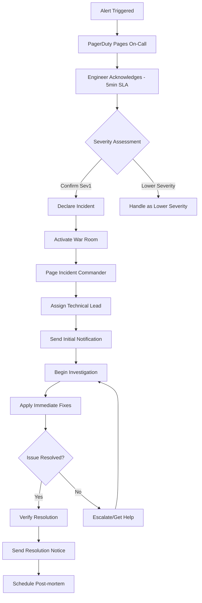

# AlertHub Enterprise - Incident Response & Escalation Procedures
# Week 4 Production Readiness - Complete Incident Management

## Table of Contents
1. [Incident Classification](#incident-classification)
2. [Response Teams & Roles](#response-teams--roles)
3. [Escalation Matrix](#escalation-matrix)
4. [Communication Protocols](#communication-protocols)
5. [Incident Response Workflows](#incident-response-workflows)
6. [Automated Response Procedures](#automated-response-procedures)
7. [Post-Incident Procedures](#post-incident-procedures)
8. [Emergency Contacts](#emergency-contacts)

---

## Incident Classification

### Severity Definitions

#### **Severity 1 (Critical) - Response Time: 5 minutes**
**Impact**: Complete system outage, data loss, security breach affecting production

**Criteria**:
- AlertHub completely inaccessible (>95% users affected)
- Data corruption or significant data loss
- Security breach with confirmed data exposure
- Revenue-impacting service failure
- Regulatory compliance violation

**Example Scenarios**:
- All AlertHub services down
- Database corruption/failure
- Authentication system compromised
- Major data leak discovered

**Response**: Immediate PagerDuty escalation, War Room activated

#### **Severity 2 (High) - Response Time: 15 minutes**
**Impact**: Major functionality unavailable, significant performance degradation

**Criteria**:
- Critical features unavailable (25-95% users affected)
- Severe performance degradation (>5x normal response time)
- Data integrity issues (non-critical)
- Major integrations failing
- Backup systems failure

**Example Scenarios**:
- AI correlation engine failure
- Major API endpoints returning errors
- Database performance severely degraded
- Critical third-party integrations down

**Response**: On-call engineer responds, stakeholders notified

#### **Severity 3 (Medium) - Response Time: 1 hour**
**Impact**: Moderate functionality issues, some users affected

**Criteria**:
- Non-critical features unavailable (<25% users affected)
- Moderate performance issues (2-5x normal response time)
- Partial service degradation
- Non-critical integrations affected

**Example Scenarios**:
- Frontend UI loading slowly
- Some correlation rules not working
- Email notifications delayed
- Dashboard widgets not updating

**Response**: On-call engineer investigates during business hours

#### **Severity 4 (Low) - Response Time: Next business day**
**Impact**: Minor issues, cosmetic problems, enhancement requests

**Criteria**:
- Cosmetic UI issues
- Minor feature requests
- Documentation updates needed
- Performance optimizations

**Example Scenarios**:
- UI styling issues
- Minor feature enhancements
- Log level adjustments
- Configuration optimizations

**Response**: Scheduled maintenance or next sprint

---

## Response Teams & Roles

### **Primary Response Team**

#### **Incident Commander (IC)**
- **Responsibility**: Overall incident coordination and decision making
- **Authority**: Make technical decisions, authorize emergency changes
- **Skills Required**: Senior SRE/Engineering Manager level
- **Backup**: Deputy IC from senior SRE team

**Key Actions**:
```bash
# Declare incident
./scripts/incident-management/declare-incident.sh --severity=1 --description="Complete service outage"

# Activate war room
./scripts/incident-management/activate-war-room.sh --incident-id=INC-2024-001

# Coordinate response
./scripts/incident-management/coordinate-response.sh --team="sre,backend,ai"
```

#### **Technical Lead (TL)**
- **Responsibility**: Technical investigation and resolution
- **Authority**: Execute technical changes, coordinate with development teams
- **Skills Required**: Senior engineer with AlertHub expertise
- **Backup**: Senior engineers from relevant teams

**Key Actions**:
```bash
# Initial system assessment
./scripts/deploy/production-validation-rollback.sh validate

# Gather diagnostic data
./scripts/incident-management/gather-diagnostics.sh --output=/tmp/incident-data/

# Execute fixes
kubectl apply -f incident-patches/
```

#### **Communications Lead (CL)**
- **Responsibility**: Stakeholder communication and status updates
- **Authority**: Send communications on behalf of engineering team
- **Skills Required**: Technical communication skills
- **Backup**: Product Manager or Engineering Manager

**Key Actions**:
```bash
# Send initial notification
./scripts/incident-management/send-notification.sh --type=initial --severity=1

# Update status page
./scripts/incident-management/update-status-page.sh --status="investigating"

# Stakeholder updates
./scripts/incident-management/notify-stakeholders.sh --frequency=15min
```

### **Specialist Teams**

#### **Database Team**
- **Escalation Trigger**: Database-related alerts or performance issues
- **Response Time**: 15 minutes for Sev1/2, 1 hour for Sev3
- **On-Call**: 24/7 coverage via PagerDuty rotation

#### **AI/ML Team**
- **Escalation Trigger**: AI correlation failures, model performance issues
- **Response Time**: 30 minutes for Sev1/2, 4 hours for Sev3
- **On-Call**: Business hours + emergency contact

#### **Security Team**
- **Escalation Trigger**: Security alerts, suspicious activities
- **Response Time**: Immediate for security incidents
- **On-Call**: 24/7 security operations center

#### **Network Operations**
- **Escalation Trigger**: Network connectivity, DNS, load balancer issues
- **Response Time**: 10 minutes for Sev1/2
- **On-Call**: 24/7 NOC coverage

---

## Escalation Matrix

### **Automatic Escalation Timeline**

```yaml
escalation_rules:
  severity_1:
    - time: 0min
      action: page_on_call_engineer
      team: sre
    - time: 5min
      action: page_incident_commander
      team: sre_management
    - time: 15min
      action: page_engineering_manager
      team: engineering_management
    - time: 30min
      action: page_vp_engineering
      team: executive
    - time: 60min
      action: page_cto
      team: executive
      
  severity_2:
    - time: 0min
      action: page_on_call_engineer
      team: sre
    - time: 15min
      action: page_senior_sre
      team: sre
    - time: 45min
      action: page_incident_commander
      team: sre_management
    - time: 2hrs
      action: page_engineering_manager
      team: engineering_management
      
  severity_3:
    - time: 0min
      action: create_ticket
      team: sre
    - time: 1hr
      action: page_on_call_engineer
      team: sre
    - time: 4hrs
      action: page_senior_sre
      team: sre
```

### **Manual Escalation Triggers**

#### **Technical Escalation**
```bash
# Escalate to specialist teams
./scripts/incident-management/escalate.sh --team=database --reason="database performance degraded"
./scripts/incident-management/escalate.sh --team=ai-ml --reason="correlation engine failure"
./scripts/incident-management/escalate.sh --team=security --reason="suspicious activity detected"

# Escalate to management
./scripts/incident-management/escalate.sh --level=manager --reason="unable to resolve in SLA"
./scripts/incident-management/escalate.sh --level=executive --reason="customer escalation"
```

#### **Business Impact Escalation**
- **Revenue Impact**: Immediate escalation to VP Engineering
- **Customer Escalation**: Escalate to Director of Engineering + Product
- **Regulatory/Compliance**: Immediate escalation to Legal + Compliance teams
- **Media Attention**: Escalate to Communications team

### **Escalation Contacts**

```bash
# Emergency escalation script
#!/bin/bash
INCIDENT_ID="$1"
ESCALATION_LEVEL="$2"
REASON="$3"

case "$ESCALATION_LEVEL" in
    "technical")
        # Page relevant technical teams
        curl -X POST "$PAGERDUTY_API/incidents" \
            -H "Authorization: Token $PAGERDUTY_TOKEN" \
            -d "{\"incident\":{\"type\":\"incident\",\"title\":\"AlertHub: $REASON\",\"service\":\"$TECHNICAL_SERVICE_ID\"}}"
        ;;
    "management")
        # Page engineering management
        curl -X POST "$PAGERDUTY_API/incidents" \
            -H "Authorization: Token $PAGERDUTY_TOKEN" \
            -d "{\"incident\":{\"type\":\"incident\",\"title\":\"AlertHub Escalation: $REASON\",\"service\":\"$MANAGEMENT_SERVICE_ID\"}}"
        ;;
    "executive")
        # Page executive team
        curl -X POST "$PAGERDUTY_API/incidents" \
            -H "Authorization: Token $PAGERDUTY_TOKEN" \
            -d "{\"incident\":{\"type\":\"incident\",\"title\":\"AlertHub Executive Escalation: $REASON\",\"service\":\"$EXECUTIVE_SERVICE_ID\"}}"
        ;;
esac
```

---

## Communication Protocols

### **Communication Channels**

#### **Internal Communications**
- **Slack Channels**:
  - `#alerthub-incidents` - Primary incident coordination
  - `#alerthub-war-room` - Active incident discussion (Sev1/2)
  - `#engineering-alerts` - Engineering team notifications
  - `#executive-alerts` - Executive notifications (Sev1 only)

#### **External Communications**
- **Status Page**: https://status.internal.example.com/alerthub
- **Customer Notifications**: Via email and in-app notifications
- **Stakeholder Updates**: Direct emails to affected teams

### **Communication Templates**

#### **Initial Incident Notification**
```markdown
🚨 **INCIDENT DECLARED** - AlertHub Production

**Incident ID**: INC-2024-001
**Severity**: {{ severity }}
**Status**: Investigating
**Impact**: {{ impact_description }}
**Started**: {{ incident_start_time }}

**Current Actions**:
- Incident Commander: {{ ic_name }}
- Technical Lead: {{ tl_name }}
- War Room: {{ war_room_link }}

**Next Update**: In 15 minutes

**Status Page**: https://status.internal.example.com/alerthub
```

#### **Status Update Template**
```markdown
📊 **UPDATE** - AlertHub Incident INC-2024-001

**Status**: {{ current_status }}
**Duration**: {{ incident_duration }}
**Impact**: {{ current_impact }}

**Progress**:
- ✅ {{ completed_action_1 }}
- ⏳ {{ in_progress_action }}
- 📋 {{ next_action }}

**ETA for Resolution**: {{ eta }}
**Next Update**: {{ next_update_time }}
```

#### **Resolution Notification**
```markdown
✅ **RESOLVED** - AlertHub Incident INC-2024-001

**Duration**: {{ total_duration }}
**Root Cause**: {{ root_cause_summary }}
**Resolution**: {{ resolution_summary }}

**Follow-up Actions**:
- Post-mortem scheduled for {{ postmortem_date }}
- Preventive measures being implemented
- Monitoring enhanced to detect similar issues

**Post-mortem will be shared**: {{ postmortem_eta }}
```

### **Communication Schedule**

```yaml
communication_schedule:
  severity_1:
    initial: "immediate"
    updates: "every_15_minutes"
    stakeholder_notification: "immediate"
    customer_notification: "within_30_minutes"
    
  severity_2:
    initial: "within_15_minutes"
    updates: "every_30_minutes"
    stakeholder_notification: "within_1_hour"
    customer_notification: "if_customer_facing"
    
  severity_3:
    initial: "within_1_hour"
    updates: "every_2_hours"
    stakeholder_notification: "daily"
    customer_notification: "if_requested"
```

---

## Incident Response Workflows

### **Severity 1 Response Workflow**



#### **Detailed Sev1 Response Steps**

**Minutes 0-5: Initial Response**
```bash
#!/bin/bash
# Incident response - Phase 1
INCIDENT_ID=$(date +%Y%m%d-%H%M%S)

# 1. Acknowledge alert
echo "Acknowledging alert for incident $INCIDENT_ID"
curl -X PUT "$PAGERDUTY_API/incidents/$ALERT_ID/acknowledge" \
    -H "Authorization: Token $PAGERDUTY_TOKEN"

# 2. Assess severity
./scripts/incident-management/assess-severity.sh --incident-id=$INCIDENT_ID

# 3. Declare incident if Sev1 confirmed
if [ "$SEVERITY" = "1" ]; then
    ./scripts/incident-management/declare-incident.sh \
        --severity=1 \
        --incident-id=$INCIDENT_ID \
        --description="$INCIDENT_DESCRIPTION"
fi
```

**Minutes 5-15: War Room Activation**
```bash
# 4. Activate war room
./scripts/incident-management/activate-war-room.sh \
    --incident-id=$INCIDENT_ID \
    --severity=1

# 5. Page incident commander
./scripts/incident-management/page-ic.sh --incident-id=$INCIDENT_ID

# 6. Initial system assessment
./scripts/deploy/production-validation-rollback.sh validate > /tmp/initial-assessment.log

# 7. Send initial notification
./scripts/incident-management/send-notification.sh \
    --type=initial \
    --incident-id=$INCIDENT_ID \
    --severity=1
```

**Minutes 15-60: Investigation & Response**
```bash
# 8. Gather diagnostic data
./scripts/incident-management/gather-diagnostics.sh \
    --incident-id=$INCIDENT_ID \
    --output=/tmp/incident-$INCIDENT_ID/

# 9. Apply immediate fixes (if known issue)
if [ -f "incident-patches/fix-for-$ISSUE_TYPE.yaml" ]; then
    kubectl apply -f incident-patches/fix-for-$ISSUE_TYPE.yaml
fi

# 10. Scale services if needed
./scripts/incident-management/emergency-scaling.sh \
    --scale-factor=2 \
    --services="ai-correlation,backend"

# 11. Regular status updates
while [ "$INCIDENT_STATUS" != "resolved" ]; do
    sleep 900  # 15 minutes
    ./scripts/incident-management/send-update.sh --incident-id=$INCIDENT_ID
done
```

### **Severity 2 Response Workflow**

```bash
#!/bin/bash
# Sev2 incident response workflow

INCIDENT_ID=$(date +%Y%m%d-%H%M%S)

# Phase 1: Assessment (0-15 min)
echo "Starting Sev2 incident response: $INCIDENT_ID"

# 1. Initial system check
./scripts/deploy/production-validation-rollback.sh smoke-test

# 2. Identify affected services
AFFECTED_SERVICES=$(kubectl get pods -n alerthub-production | grep -v Running | awk '{print $1}')

# 3. Check recent deployments
RECENT_DEPLOYMENTS=$(kubectl rollout history deployment -n alerthub-production --revision=1)

# Phase 2: Mitigation (15-60 min)
# 4. Apply known fixes
./scripts/incident-management/apply-standard-fixes.sh --severity=2

# 5. Scale affected services
for service in $AFFECTED_SERVICES; do
    kubectl scale deployment $service --replicas=+2 -n alerthub-production
done

# 6. Monitor and verify
./scripts/incident-management/monitor-recovery.sh --duration=30min
```

---

## Automated Response Procedures

### **Auto-Remediation Scripts**

#### **High Memory Usage Auto-Response**
```bash
#!/bin/bash
# Auto-remediation for high memory usage
THRESHOLD=0.9
NAMESPACE="alerthub-production"

# Check memory usage
MEMORY_USAGE=$(kubectl top pods -n $NAMESPACE --no-headers | awk '{print $3}' | sed 's/%//' | sort -nr | head -1)

if [ "$MEMORY_USAGE" -gt "$(echo "$THRESHOLD * 100" | bc)" ]; then
    echo "High memory usage detected: ${MEMORY_USAGE}%"
    
    # Scale up affected deployments
    HIGH_MEMORY_PODS=$(kubectl top pods -n $NAMESPACE --no-headers | awk '$3 > 80 {print $1}')
    
    for pod in $HIGH_MEMORY_PODS; do
        DEPLOYMENT=$(kubectl get pod $pod -n $NAMESPACE -o jsonpath='{.metadata.ownerReferences[0].name}')
        CURRENT_REPLICAS=$(kubectl get deployment $DEPLOYMENT -n $NAMESPACE -o jsonpath='{.spec.replicas}')
        NEW_REPLICAS=$((CURRENT_REPLICAS + 2))
        
        echo "Scaling $DEPLOYMENT from $CURRENT_REPLICAS to $NEW_REPLICAS"
        kubectl scale deployment $DEPLOYMENT --replicas=$NEW_REPLICAS -n $NAMESPACE
        
        # Send notification
        curl -X POST $SLACK_WEBHOOK \
            -H "Content-Type: application/json" \
            -d "{\"text\": \"🚨 Auto-scaled $DEPLOYMENT due to high memory usage: ${MEMORY_USAGE}%\"}"
    done
fi
```

#### **Service Down Auto-Recovery**
```bash
#!/bin/bash
# Auto-recovery for service outages
SERVICE="$1"
NAMESPACE="alerthub-production"

echo "Attempting auto-recovery for service: $SERVICE"

# 1. Check service status
SERVICE_STATUS=$(kubectl get service $SERVICE -n $NAMESPACE -o jsonpath='{.status.conditions[0].type}' 2>/dev/null || echo "NotFound")

if [ "$SERVICE_STATUS" != "Ready" ]; then
    echo "Service $SERVICE is not ready, attempting recovery..."
    
    # 2. Restart deployment
    kubectl rollout restart deployment $SERVICE -n $NAMESPACE
    
    # 3. Wait for rollout
    kubectl rollout status deployment $SERVICE -n $NAMESPACE --timeout=300s
    
    # 4. Verify service health
    sleep 30
    HEALTH_CHECK=$(curl -s -o /dev/null -w "%{http_code}" http://$SERVICE.$NAMESPACE.svc.cluster.local/health)
    
    if [ "$HEALTH_CHECK" = "200" ]; then
        echo "✅ Auto-recovery successful for $SERVICE"
        curl -X POST $SLACK_WEBHOOK \
            -H "Content-Type: application/json" \
            -d "{\"text\": \"✅ Auto-recovery successful for $SERVICE\"}"
    else
        echo "❌ Auto-recovery failed for $SERVICE"
        curl -X POST $SLACK_WEBHOOK \
            -H "Content-Type: application/json" \
            -d "{\"text\": \"❌ Auto-recovery failed for $SERVICE - manual intervention required\"}"
    fi
fi
```

#### **Database Connection Recovery**
```bash
#!/bin/bash
# Auto-recovery for database connection issues
NAMESPACE="alerthub-production"

echo "Checking database connectivity..."

# Test database connection
DB_TEST=$(kubectl run db-test-$(date +%s) -n $NAMESPACE \
    --image=postgres:14-alpine --rm -i --restart=Never \
    --command -- psql -h postgres-primary -U alerthub -c "SELECT 1;" 2>&1)

if echo "$DB_TEST" | grep -q "could not connect"; then
    echo "Database connection failed, attempting recovery..."
    
    # 1. Check database pod status
    DB_POD_STATUS=$(kubectl get pods -n $NAMESPACE -l app=postgres-primary -o jsonpath='{.items[0].status.phase}')
    
    if [ "$DB_POD_STATUS" != "Running" ]; then
        # 2. Restart database pod
        kubectl delete pod -n $NAMESPACE -l app=postgres-primary
        kubectl wait --for=condition=ready pod -l app=postgres-primary -n $NAMESPACE --timeout=300s
    fi
    
    # 3. Restart applications to refresh connections
    kubectl rollout restart deployment alerthub-backend-prod -n $NAMESPACE
    kubectl rollout restart deployment ai-correlation-engine-prod -n $NAMESPACE
    
    echo "Database recovery initiated"
    curl -X POST $SLACK_WEBHOOK \
        -H "Content-Type: application/json" \
        -d "{\"text\": \"🔄 Database connection issue detected - auto-recovery initiated\"}"
fi
```

### **Circuit Breaker Patterns**

```python
# Circuit breaker implementation for critical services
import time
import requests
from enum import Enum

class CircuitState(Enum):
    CLOSED = 1
    OPEN = 2
    HALF_OPEN = 3

class CircuitBreaker:
    def __init__(self, failure_threshold=5, recovery_timeout=60, expected_exception=Exception):
        self.failure_threshold = failure_threshold
        self.recovery_timeout = recovery_timeout
        self.expected_exception = expected_exception
        self.failure_count = 0
        self.last_failure_time = None
        self.state = CircuitState.CLOSED

    def call(self, func, *args, **kwargs):
        if self.state == CircuitState.OPEN:
            if time.time() - self.last_failure_time > self.recovery_timeout:
                self.state = CircuitState.HALF_OPEN
            else:
                raise Exception("Circuit breaker is OPEN")

        try:
            result = func(*args, **kwargs)
            self.reset()
            return result
        except self.expected_exception as e:
            self.record_failure()
            raise e

    def record_failure(self):
        self.failure_count += 1
        self.last_failure_time = time.time()
        
        if self.failure_count >= self.failure_threshold:
            self.state = CircuitState.OPEN
            # Send alert
            self.send_circuit_breaker_alert()

    def reset(self):
        self.failure_count = 0
        self.state = CircuitState.CLOSED

    def send_circuit_breaker_alert(self):
        payload = {
            "text": f"🔴 Circuit breaker OPENED - service failing repeatedly"
        }
        requests.post(SLACK_WEBHOOK, json=payload)
```

---

## Post-Incident Procedures

### **Immediate Post-Resolution (0-2 hours)**

```bash
#!/bin/bash
# Post-incident immediate actions
INCIDENT_ID="$1"

echo "Starting post-incident procedures for $INCIDENT_ID"

# 1. Send resolution notification
./scripts/incident-management/send-notification.sh \
    --type=resolution \
    --incident-id=$INCIDENT_ID

# 2. Update status page
./scripts/incident-management/update-status-page.sh \
    --status="operational" \
    --message="All systems operational"

# 3. Gather final metrics
./scripts/incident-management/gather-final-metrics.sh \
    --incident-id=$INCIDENT_ID \
    --output=/tmp/incident-$INCIDENT_ID-final/

# 4. Schedule post-mortem
./scripts/incident-management/schedule-postmortem.sh \
    --incident-id=$INCIDENT_ID \
    --within="72_hours"

# 5. Thank the response team
./scripts/incident-management/thank-team.sh \
    --incident-id=$INCIDENT_ID \
    --channel="#alerthub-incidents"
```

### **Post-Mortem Process**

#### **Post-Mortem Template**
```markdown
# Post-Mortem: AlertHub Incident {{ incident_id }}

## Incident Summary
- **Date**: {{ incident_date }}
- **Duration**: {{ total_duration }}
- **Severity**: {{ severity_level }}
- **Impact**: {{ impact_description }}
- **Root Cause**: {{ root_cause_summary }}

## Timeline
| Time | Action | Owner |
|------|--------|-------|
| {{ time_1 }} | {{ action_1 }} | {{ owner_1 }} |
| {{ time_2 }} | {{ action_2 }} | {{ owner_2 }} |

## Root Cause Analysis
### What Went Wrong
{{ detailed_root_cause }}

### Why It Happened
{{ contributing_factors }}

### Detection and Response
{{ detection_timeline }}
{{ response_effectiveness }}

## Impact Assessment
### Users Affected
- **Total Users**: {{ total_users_affected }}
- **Duration**: {{ impact_duration }}
- **Services Impacted**: {{ impacted_services }}

### Business Impact
- **Revenue Impact**: {{ revenue_impact }}
- **SLA Impact**: {{ sla_impact }}
- **Customer Escalations**: {{ customer_escalations }}

## What Went Well
{{ positive_aspects }}

## What Could Be Improved
{{ improvement_areas }}

## Action Items
| Action | Owner | Due Date | Priority |
|--------|-------|----------|----------|
| {{ action_1 }} | {{ owner_1 }} | {{ due_1 }} | {{ priority_1 }} |
| {{ action_2 }} | {{ owner_2 }} | {{ due_2 }} | {{ priority_2 }} |

## Preventive Measures
### Immediate Actions (< 1 week)
{{ immediate_actions }}

### Short-term Actions (< 1 month)
{{ short_term_actions }}

### Long-term Actions (< 3 months)
{{ long_term_actions }}

## Monitoring and Alerting Improvements
{{ monitoring_improvements }}

## Lessons Learned
{{ lessons_learned }}
```

---

## Emergency Contacts

### **Primary On-Call Rotation**
```yaml
on_call_schedule:
  primary_sre:
    schedule: "24/7"
    escalation: "5_minutes"
    contacts:
      - name: "SRE Team Primary"
        phone: "+1-XXX-XXX-XXXX"
        pagerduty: "sre-primary@apple.pagerduty.com"
        
  secondary_sre:
    schedule: "24/7"
    escalation: "15_minutes"
    contacts:
      - name: "SRE Team Secondary"
        phone: "+1-XXX-XXX-XXXX"
        pagerduty: "sre-secondary@apple.pagerduty.com"
        
  incident_commander:
    schedule: "business_hours_extended"
    escalation: "30_minutes"
    contacts:
      - name: "Senior SRE Manager"
        phone: "+1-XXX-XXX-XXXX"
        pagerduty: "ic-primary@apple.pagerduty.com"
```

### **Specialist Team Contacts**
```yaml
specialist_teams:
  database:
    primary: "dba-oncall@apple.com"
    phone: "+1-XXX-XXX-XXXX"
    escalation: "dba-manager@apple.com"
    
  security:
    primary: "security-oncall@apple.com"
    phone: "+1-XXX-XXX-XXXX"
    escalation: "security-manager@apple.com"
    
  ai_ml:
    primary: "ai-team-oncall@apple.com"
    business_hours_only: true
    escalation: "ai-team-lead@apple.com"
    
  network:
    primary: "network-oncall@apple.com"
    phone: "+1-XXX-XXX-XXXX"
    escalation: "network-manager@apple.com"
```

### **Management Escalation**
```yaml
management_contacts:
  engineering_manager:
    name: "Engineering Manager"
    email: "engineering-manager@apple.com"
    phone: "+1-XXX-XXX-XXXX"
    escalation_threshold: "30_minutes_sev1"
    
  director_engineering:
    name: "Director of Engineering"
    email: "director-eng@apple.com"
    phone: "+1-XXX-XXX-XXXX"
    escalation_threshold: "1_hour_sev1"
    
  vp_engineering:
    name: "VP Engineering"
    email: "vp-eng@apple.com"
    phone: "+1-XXX-XXX-XXXX"
    escalation_threshold: "2_hours_sev1"
```

---

**Document Version**: v1.0  
**Last Updated**: 2024-04-14  
**Next Review**: 2024-05-14  
**Owner**: SRE Team